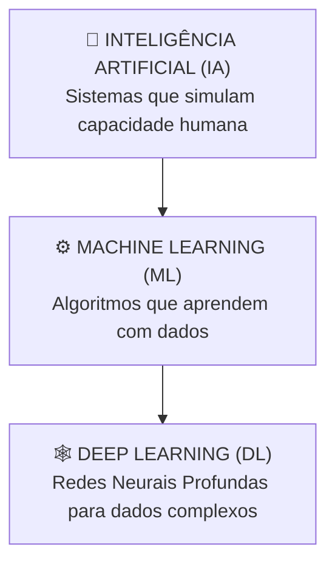

# Aula 01 - Introdução à Inteligência Artificial e Machine Learning

**Disciplina:** Aprendizado de Máquina e Redes Neurais  
**Professor:** Eduardo Lázaro Roesler de Oliveira  
**Instituição:** UNIVEM — Centro Universitário de Marília  

---

> [!NOTE]
> 🔙 **De onde viemos:** Esta é a aula inaugural! Iniciamos nossa jornada conectando o conhecimento prévio dos alunos sobre computação tradicional com a revolução impulsionada por dados.
> 🎯 **Objetivo Principal da Aula:** Compreender a evolução da IA, diferenciar Inteligência Artificial, Machine Learning e Deep Learning, dominar os 3 tipos de aprendizado e executar o primeiro script Python no Google Colab.
> 🚀 **Para onde vamos:** Na próxima aula ('Python para Ciência de Dados - Parte 1'), iniciaremos a computação vetorial com NumPy para manipular matrizes e vetores numéricos.

---

## Organização Tática da Aula

| Módulo | Atividade | Foco Pedagógico |
| :--- | :--- | :--- |
| **Módulo 1** | **Fundamentação Teórica & IA no Cotidiano** | Recomendações (Netflix/Spotify), evolução histórica e a relação IA vs ML vs Deep Learning. |
| **Módulo 2** | **Paradigmas de Aprendizado & Ciclo de Projeto** | Aprendizado Supervisionado, Não Supervisionado e por Reforço + O Pipeline de ML. |
| **Módulo 3** | **Primeiro Contato Hands-On no Google Colab** | 8 blocos de código em Python minuciosamente comentados no Scikit-Learn. |
| **Módulo 4** | **Prática Orientada & Experimentação Fácil** | Personalização rápida do modelo de classificação de flores com alteração de semente e sua própria flor. |

---

## Módulo 1: Fundamentação Teórica & Contexto do Mundo Real

### 1.1 A IA Invisível do Nosso Dia a Dia
A Inteligência Artificial não é uma promessa do futuro; ela opera continuamente nos bastidores da sociedade moderna:
- 🎬 **Recomendações Customizadas:** Netflix, Spotify e YouTube prevendo o que você deseja assistir ou ouvir com base no seu histórico.
- 📱 **Visão Computacional:** Desbloqueio facial em smartphones e filtros interativos do Instagram/TikTok.
- 🚗 **Mobilidade e Rotas:** Waze e Google Maps calculando o menor tempo de percurso ajustando-se ao trânsito em tempo real.
- 💬 **Processamento de Linguagem Natural (PLN):** Corretores ortográficos, tradutores instantâneos e assistentes virtuais (ChatGPT, Alexa, Siri).

> [!TIP]
> 🎮 **Analogia Geek — O Código Tradicional vs. A Matrix:**
> Na programação tradicional, nós somos como os arquitetos do programa: escrevemos linha por linha de regras `if/else` explícitas. Em **Machine Learning**, nós tomamos a "Pílula Vermelha" (*Red Pill*): fornecemos os dados históricos e as respostas certas, e a própria máquina descobre as regras sozinhas, como se estivesse decodificando o código da Matrix!

> [!NOTE]
> 💡 **Curiosidade da Aula — A Origem do Termo "Machine Learning" & O AlphaGo:**
> - O termo *Machine Learning* foi cunhado em **1959 por Arthur Samuel**, um pioneiro da IBM que criou um programa de computador para jogar Damas. O programa jogava contra si mesmo milhares de vezes e acabou aprendendo estratégias melhores do que o próprio criador!
> - Em 2016, no **Aprendizado por Reforço**, a IA **AlphaGo** (da Google DeepMind) chocou o mundo ao derrotar Lee Sedol, o campeão mundial de Go (um jogo de tabuleiro milenar asiático com mais combinações possíveis do que o número de átomos no universo visível!).

### 1.2 A Hierarquia Conceitual: IA vs. Machine Learning vs. Deep Learning



---

## Módulo 2: Paradigmas de Aprendizado & Ciclo de Projeto

### 2.1 Os 3 Paradigmas do Aprendizado de Máquina

| Paradigma | Como Funciona | Entrada de Dados | Exemplo Prático |
| :--- | :--- | :--- | :--- |
| **Supervisionado** | O algoritmo aprende com exemplos rotulados (Entrada + Resposta Correta). | Dados ($X$) com Rótulos ($y$) | Detecção de Spam, Previsão de Vendas, Diagnósticos Médicos. |
| **Não Supervisionado** | O algoritmo busca padrões ocultos ou agrupamentos sem respostas prévias. | Dados ($X$) sem Rótulos | Segmentação de Clientes, Detecção de Anomalias. |
| **Por Reforço** | Um agente aprende executando ações em um ambiente e recebendo recompensas ou punições. | Interação contínua com ambiente | Carros Autônomos, Jogos (AlphaGo, Dota 2, Robótica). |

> [!NOTE]
> 📌 **Por que usar o Iris Dataset no nosso primeiro código?**
> O dataset *Iris* foi criado pelo estatístico Ronald Fisher em 1936 e é considerado o "Hello World" oficial da Ciência de Dados. Escolhemos ele porque possui apenas 150 amostras, 4 colunas simples, zero nulos e permite que você foque 100% no aprendizado do código sem se preocupar com problemas de dados!
> 🔗 **Onde encontrar mais datasets públicos para praticar?**
> - [Kaggle Datasets](https://www.kaggle.com/datasets) (O maior portal do mundo para praticar Ciência de Dados).
> - [UCI Machine Learning Repository](https://archive.ics.uci.edu/) (Repositório acadêmico clássico).

---

## Módulo 3: Prática Guiada no Google Colab

Abra o [Google Colab](https://colab.research.google.com) e acompanhe a execução dos blocos de código abaixo.

---

### Bloco 3.1 — Verificando o Ambiente Python e a Versão do Interpretador
Verificamos a versão do interpretador Python em execução no servidor do Google Colab.

```python
import sys  # Módulo nativo do Python para interagir com o sistema operacional

# Exibimos a versão completa do interpretador Python para confirmação
print("--- VERIFICAÇÃO DO AMBIENTE PYTHON ---")
print(f"🐍 Versão do Python em execução no servidor: {sys.version}")
print("🔍 Tudo pronto para começarmos os primeiros passos em Ciência de Dados!")
```

---

### Bloco 3.2 — Importando as Bibliotecas Essenciais da Ciência de Dados
Importamos NumPy, Pandas, Matplotlib, Seaborn e Scikit-Learn checando suas versões.

```python
# Importamos o NumPy para manipulação numérica e vetorial
import numpy as np

# Importamos o Pandas para criação e exploração de DataFrames
import pandas as pd

# Importamos a biblioteca Matplotlib para construção de gráficos
import matplotlib.pyplot as plt

# Importamos a biblioteca Seaborn para visualizações estatísticas refinadas
import seaborn as sns

# Importamos a biblioteca Scikit-Learn (sklearn) para Machine Learning
import sklearn

# Exibimos as versões instaladas com mensagens explicativas
print("--- CHECAGEM DE FERRAMENTAS INSTALADAS ---")
print(f"✅ NumPy (Matemática Vetorial) versão:        {np.__version__}")
print(f"✅ Pandas (Manipulação de Tabelas) versão:   {pd.__version__}")
print(f"✅ Scikit-Learn (Machine Learning) versão:   {sklearn.__version__}")
print("🚀 Todas as bibliotecas fundamentais foram carregadas com sucesso!")
```

---

### Bloco 3.3 — Carregando o Iris Dataset do Scikit-Learn
Carregamos o dataset Iris e inspecionamos seu dicionário de metadados.

```python
# Importamos a função de carregamento do dataset Iris do Scikit-Learn
from sklearn.datasets import load_iris

# Carregamos o objeto completo de dados brutos da flor Iris
dados_brutos_iris = load_iris()

# Exibimos as chaves contidas no dicionário do dataset
print("--- ESTRUTURA DO DATASET IRIS ---")
print("📋 Chaves de dados disponíveis no dicionário:", dados_brutos_iris.keys())

# Exibimos os nomes dos 4 atributos de entrada (features)
print("\n📏 Nomes dos Atributos de Entrada (Features):")
for indice, nome_atributo in enumerate(dados_brutos_iris.feature_names):
    print(f"   {indice + 1}. {nome_atributo}")

# Exibimos as 3 classes de saída possíveis (target names)
print("\n🌸 Classes de Flores Possíveis (Target Names):")
for indice, nome_especie in enumerate(dados_brutos_iris.target_names):
    print(f"   ID {indice}: {nome_especie.upper()}")
```

---

### Bloco 3.4 — Estruturando os Dados em um DataFrame Pandas
Transformamos a matriz de números em uma tabela organizada com colunas rotuladas.

```python
# Criamos o DataFrame com as 4 colunas de características numéricas
tabela_iris = pd.DataFrame(
    data=dados_brutos_iris.data, 
    columns=dados_brutos_iris.feature_names
)

# Adicionamos a coluna do código numérico da classe (0, 1 ou 2)
tabela_iris['codigo_especie'] = dados_brutos_iris.target

# Criamos uma nova coluna mapeando os números 0, 1 e 2 para os nomes botânicos reais
tabela_iris['nome_especie'] = tabela_iris['codigo_especie'].map({
    0: 'setosa', 
    1: 'versicolor', 
    2: 'virginica'
})

# Exibimos o formato e as 5 primeiras linhas da tabela estruturada
print("--- VISUALIZAÇÃO DA TABELA PANDAS ESTRUTURADA ---")
print(f"📐 Dimensão da Tabela: {tabela_iris.shape[0]} linhas por {tabela_iris.shape[1]} colunas")
print("\nPrimeiros 5 registros da tabela:")
print(tabela_iris.head())
```

---

### Bloco 3.5 — Análise Exploratória Visual (Scatter Plot com Seaborn)
Plotamos um gráfico de dispersão comparando comprimento da sépala x largura da pétala.

```python
# Definimos o tamanho da figura (8 polegadas de largura por 5 de altura)
plt.figure(figsize=(8, 5))

# Plotamos a dispersão colorindo os pontos de acordo com a espécie da flor
sns.scatterplot(
    data=tabela_iris,
    x='sepal length (cm)',
    y='petal width (cm)',
    hue='nome_especie',
    palette='Set1',
    s=90
)

# Adicionamos títulos explicativos ao gráfico
plt.title("Separação Visual das Espécies de Flores Iris", fontsize=12, fontweight='bold')
plt.xlabel("Comprimento da Sépala (cm)")
plt.ylabel("Largura da Pétala (cm)")
plt.grid(True, linestyle='--', alpha=0.5)

print("🎨 Exibindo o gráfico de dispersão visual no Colab...")
plt.show()
```

---

### Bloco 3.6 — Divisão dos Dados em Treino e Teste (`train_test_split`)
Separamos a matriz `matriz_entradas` e o vetor `vetor_respostas`, reservando 20% para teste com nomes de variáveis por extenso.

```python
# Importamos a função de divisão treino/teste do Scikit-Learn
from sklearn.model_selection import train_test_split

# Isolamos a matriz de entrada X (4 colunas) e o vetor resposta y (código da espécie)
matriz_entradas = dados_brutos_iris.data
vetor_respostas = dados_brutos_iris.target

# Dividimos os dados com nomes totalmente por extenso: 80% treino e 20% teste
matriz_entradas_treino, matriz_entradas_teste, vetor_respostas_treino, vetor_respostas_teste = train_test_split(
    matriz_entradas, 
    vetor_respostas, 
    test_size=0.20, 
    random_state=42
)

# Exibimos a contagem detalhada de amostras reservadas
print("--- DIVISÃO DE DADOS (TREINO E TESTE) ---")
print(f"📦 Amostras reservadas para TREINO (80%): {matriz_entradas_treino.shape[0]} flores")
print(f"🧪 Amostras reservadas para TESTE  (20%): {matriz_entradas_teste.shape[0]} flores")
print("✅ Os dados foram separados com sucesso sem contaminação do conjunto de teste!")
```

---

### Bloco 3.7 — Treinamento do Modelo de Árvore de Decisão (`fit`)
Instanciamos o algoritmo `DecisionTreeClassifier` e realizamos o treinamento com os dados de treino.

```python
# Importamos o algoritmo de Árvore de Decisão do Scikit-Learn
from sklearn.tree import DecisionTreeClassifier

# Instanciamos o objeto do classificador com semente aleatória fixa
modelo_arvore_decisao = DecisionTreeClassifier(random_state=42)

# ETAPA DE APRENDIZADO (fit): O algoritmo analisa os dados de treino para aprender as regras
modelo_arvore_decisao.fit(matriz_entradas_treino, vetor_respostas_treino)

print("🎉 MODELO DE ÁRVORE DE DECISÃO TREINADO COM SUCESSO!")
print("🧠 A IA já aprendeu a diferenciar os 3 tipos de flores com base em sépalas e pétalas!")
```

---

### Bloco 3.8 — Predição e Avaliação da Acurácia (`predict` e `accuracy_score`)
Submetemos os dados de teste para predição e calculamos a porcentagem de acertos.

```python
# Importamos a métrica de acurácia do Scikit-Learn
from sklearn.metrics import accuracy_score

# O modelo realiza previsões para as 30 flores reservadas para teste
previsoes_teste = modelo_arvore_decisao.predict(matriz_entradas_teste)

# Calculamos a acurácia comparando as respostas reais com as predições da IA
acuracia_final = accuracy_score(vetor_respostas_teste, previsoes_teste)

print("--- RESULTADO DA AVALIAÇÃO DO MODELO ---")
print(f"📊 Respostas Reais do Teste:    {vetor_respostas_teste}")
print(f"🔮 Respostas Previstas pela IA: {previsoes_teste}")
print(f"\n🌟 Taxa de Acurácia Obtida: {acuracia_final * 100:.2f}% de acertos nos dados de teste!")
```

---

### Bloco 3.9 — Fazendo uma Previsão para uma Planta Totalmente Nova
Enviamos as 4 medidas de uma flor que a máquina nunca viu para ser classificada.

```python
# Criamos as medidas de uma flor nova: [sépala_comp, sépala_larg, pétala_comp, pétala_larg]
medidas_flor_nova = [[5.1, 3.5, 1.4, 0.2]]

# O modelo realiza a previsão para esta nova flor
codigo_classe_previsto = modelo_arvore_decisao.predict(medidas_flor_nova)[0]

# Convertemos o ID numérico para o nome botânico real
nome_flor_prevista = dados_brutos_iris.target_names[codigo_classe_previsto]

print("--- PREVISÃO EM TEMPO REAL PARA UMA NOVA FLOR ---")
print(f"📏 Medidas Informadas: {medidas_flor_nova[0]}")
print(f"🌷 Resultado da IA: A flor foi classificada como ---> {nome_flor_prevista.upper()} <---")
```

---

## Módulo 4: Prática Orientada & Experimentação Fácil

### Roteiro de Personalização para o Estudante:
Agora é a sua vez de testar o seu próprio modelo! O código abaixo já está 100% pronto. Você só precisa **alterar os números indicados nos comentários 1 e 2**, rodar e ver o seu resultado personalizado!

1. **Altere a sua data/semente:** No parâmetro `semente_aniversario = 15`, mude o número `15` para o dia do seu aniversário (ex: `7`, `22`, `30`).
2. **Crie a sua própria flor:** Altere as 4 medidas em `minhas_medidas_flor = [[6.2, 2.8, 4.8, 1.8]]` colocando valores de sua preferência e veja qual espécie a IA identifica para a sua flor!

```python
# =============================================================================
# CÓDIGO BASE PRONTO PARA SUA EXPERIMENTAÇÃO
# =============================================================================
from sklearn.neighbors import KNeighborsClassifier
from sklearn.metrics import accuracy_score
from sklearn.model_selection import train_test_split
from sklearn.datasets import load_iris

dados_iris = load_iris()
matriz_entradas = dados_iris.data
vetor_respostas = dados_iris.target

# 1. Altere o numero 15 abaixo para o dia do seu aniversario:
semente_aniversario = 15

matriz_treino, matriz_teste, respostas_treino, respostas_teste = train_test_split(
    matriz_entradas, 
    vetor_respostas, 
    test_size=0.25, 
    random_state=semente_aniversario
)

# Instanciamos o algoritmo KNN (K-Vizinhos Mais Próximos)
modelo_knn_estudante = KNeighborsClassifier(n_neighbors=5)
modelo_knn_estudante.fit(matriz_treino, respostas_treino)

# Avaliamos a acurácia da sua configuração
acuracia_estudante = accuracy_score(respostas_teste, modelo_knn_estudante.predict(matriz_teste))
print(f"📊 Acurácia do seu modelo personalizado (Semente {semente_aniversario}): {acuracia_estudante * 100:.2f}%")

# 2. Digite 4 medidas de sua escolha para a sua flor [sépala_comp, sépala_larg, pétala_comp, pétala_larg]:
minhas_medidas_flor = [[6.2, 2.8, 4.8, 1.8]]

codigo_previsto = modelo_knn_estudante.predict(minhas_medidas_flor)[0]
especie_descoberta = dados_iris.target_names[codigo_previsto]
print(f"🌻 A sua flor personalizada foi classificada como: ---> {especie_descoberta.upper()} <---")
```

---

## Módulo 5: Checklist de Autonomia do Estudante

- [ ] Consigo explicar a diferença entre IA, Machine Learning e Deep Learning.
- [ ] Sei diferenciar os 3 paradigmas: Supervisionado, Não Supervisionado e por Reforço.
- [ ] Sei acessar o Google Colab e executar blocos de código em Python.
- [ ] Entendi a utilidade das bibliotecas NumPy, Pandas e Scikit-Learn.
- [ ] Consegui alterar os valores da minha flor e ver a IA classificá-la no Colab.

---

## Referências Bibliográficas & Documentações Oficiais

- 📖 **Livro Texto:** Géron, A. — *Mãos à Obra: Aprendizado de Máquina com Scikit-Learn, Keras & TensorFlow* (Capítulo 1: O Panorama do Aprendizado de Máquina).
- 🔗 **Documentação Scikit-Learn:** [scikit-learn.org - DecisionTreeClassifier](https://scikit-learn.org/stable/modules/generated/sklearn.tree.DecisionTreeClassifier.html)
- 🎥 **Vídeo Recomendado (Didática Tech):** [O que é Machine Learning? (YouTube)](https://www.youtube.com/watch?v=0Prg8D0qf9U)
