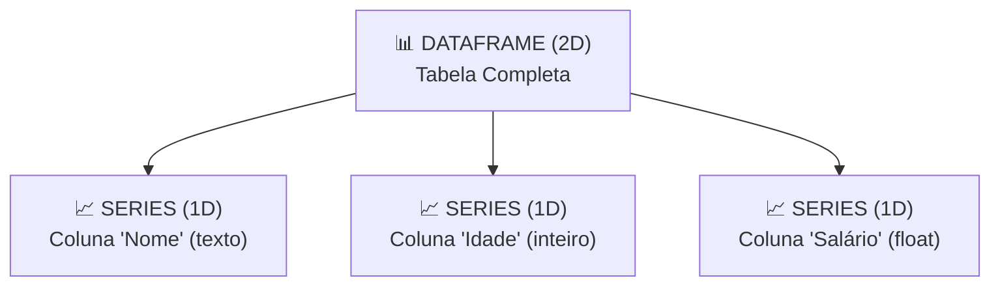

# Aula 03 - Python para Ciência de Dados - Parte 2 (Pandas DataFrames & Exploração)

**Disciplina:** Aprendizado de Máquina e Redes Neurais  
**Professor:** Eduardo Lázaro Roesler de Oliveira  
**Instituição:** UNIVEM — Centro Universitário de Marília  

---

> [!NOTE]
> 🔙 **De onde viemos:** Na Aula 02, aprendemos a fazer operações matemáticas ultrarrápidas em matrizes numéricas com o NumPy. Agora precisamos dar contexto a esses números trabalhando com tabelas estruturadas do mundo real.
> 🎯 **Objetivo Principal da Aula:** Dominar a biblioteca **Pandas**, explorando DataFrames e Series, aplicando técnicas de inspeção estatística (`describe`, `info`), seleção por rótulo/posição (`loc`/`iloc`), filtros condicionais e agregações por categoria (`groupby`).
> 🚀 **Para onde vamos:** Na próxima aula ('Preparação e Tratamento de Dados - Parte 1'), enfrentaremos a dura realidade: tabelas do mundo real chegam incompletas, com dados ausentes (`NaN`), duplicatas e erros grosseiros que precisamos limpar antes de qualquer análise.

---

## Organização Tática da Aula

| Módulo | Atividade | Foco Pedagógico |
| :--- | :--- | :--- |
| **Módulo 1** | **Fundamentação Teórica & Estruturas do Pandas** | Diferença entre Series (1D) e DataFrames (2D), leitura de arquivos CSV/Excel. |
| **Módulo 2** | **Seleção de Dados & Agrupamentos** | Seleção gradual de colunas, linhas e primeiro contato com `.loc`, `.iloc` e `.groupby()`. |
| **Módulo 3** | **Prática Guiada no Google Colab** | 8 blocos de código em Python/Pandas minuciosamente comentados linha a linha com caixas de dúvidas. |
| **Módulo 4** | **Prática Orientada & Experimentação Fácil** | Filtragem condicional customizada de inventário de loja Geek/Games. |
| **Módulo 5** | **Checklist de Autonomia & Bibliografia** | Autoavaliação do estudante e referências oficiais. |

---

## Módulo 1: Fundamentação Teórica & Estruturas do Pandas

### 1.1 Por que o Pandas é o "Excel do Cientista de Dados"?
Enquanto o NumPy trabalha puramente com dados numéricos homogêneos, o **Pandas** traz a flexibilidade das tabelas do mundo real:
- Permite colunas com diferentes tipos de dados (`int`, `float`, `string`, `datetime`, `boolean`) em uma mesma tabela.
- Possui rotulagem explícita para linhas (índices) e colunas (nomes dos atributos).
- Oferece suporte nativo para carregar arquivos CSV, Excel, SQL e JSON em poucas linhas de código.



> [!TIP]
> 🛒 **Analogia Geek — O Inventário de um Jogo de RPG / Loja Geek:**
> Imagine a tabela do seu inventário num jogo: cada item tem um `Nome` (texto), `Raridade` (categoria), `Preço em Ouro` (número) e `Equipado` (booleano). O **Pandas** é a mochila mágica perfeita para organizar, ordenar e filtrar esses itens instantaneamente!

> [!NOTE]
> 💡 **Curiosidade da Aula — A Origem do Pandas:**
> O Pandas foi desenvolvido em **2008 por Wes McKinney** enquanto ele trabalhava na AQR Capital Management (um grande fundo de investimento quantitativo em New York). Wes estava frustrado porque o Excel travava com arquivos financeiros grandes e o R não era amigável. Ele criou o Pandas (nome derivado de *PANel DAtaS*) para ser o "Excel programável em Python"! Hoje ele é usado por 100% das empresas de tecnologia do mundo!  
> 🔗 **Documentação Oficial Pandas:** [pandas.pydata.org/docs](https://pandas.pydata.org/docs/)

> [!IMPORTANT]
> 💡 **Em 1 Frase:** Um DataFrame é uma tabela bidimensional com nomes nas colunas e linhas, enquanto uma Series é uma única coluna isolada dessa tabela.

---

## Módulo 2: O Mecanismo por Dentro & Regras Práticas

### 2.1 Principais Métodos de Inspeção de DataFrames

| Método / Propriedade | O que faz | Exemplo de Saída |
| :--- | :--- | :--- |
| `df.head(n)` | Exibe as $n$ primeiras linhas da tabela (padrão $n=5$). | Primeiros registros para inspeção visual. |
| `df.info()` | Exibe o total de linhas, colunas, tipos de dados e nulos. | Resumo estrutural completo da tabela. |
| `df.describe()` | Gera resumo estatístico automático (média, std, min, max). | Tabela estatística para colunas numéricas. |
| `df.shape` | Retorna a tupla `(linhas, colunas)`. | `(150, 5)` |
| `df['coluna'].value_counts()` | Conta a frequência de cada categoria única em uma coluna. | Frequência de rótulos/classes. |

> [!IMPORTANT]
> 💡 **Em 1 Frase:** Métodos como `.info()` e `.describe()` fornecem raio-X imediato do tamanho, tipos e estatísticas gerais de qualquer tabela em poucas linhas de código.

---

## Módulo 3: Prática Guiada no Google Colab

Abra o [Google Colab](https://colab.research.google.com), crie um novo Notebook e acompanhe os blocos de código abaixo.

> [!NOTE]
> **Ponte com Python:** os dados iniciais serão escritos como um dicionário. Pense nele como uma ficha: cada nome à esquerda é o título de uma coluna e a lista à direita guarda os valores dessa coluna. Não é necessário decorar a sintaxe; vamos usá-la como ponto de partida para criar a tabela.

---

### Bloco 3.1 — Importando Pandas e Criando um DataFrame Manualmente

> [!IMPORTANT]
> 🤔 **Dúvidas Comuns de Iniciantes:**  
> **Como o Pandas transforma dicionários Python em tabelas?**  
> As chaves do dicionário viram os nomes das colunas (cabeçalhos) e as listas associadas viram as linhas da tabela. Todas as listas precisam ter exatamente o mesmo número de elementos!

> [!TIP]
> Antes de executar, localize no código a coluna chamada `'nome'`. Quantos nomes ela possui? O DataFrame terá essa mesma quantidade de linhas.

```python
# 1. Importamos a biblioteca Pandas com o alias padrão 'pd'
import pandas as pd

# 2. Importamos o NumPy para suporte a operações numéricas
import numpy as np

# 3. Criamos um dicionário contendo listas do mesmo tamanho para formar as colunas
dicionario_clientes = {
    'cliente_id': [101, 102, 103, 104, 105],
    'nome': ['Ana Silva', 'Bruno Souza', 'Carla Dias', 'Diego Ramos', 'Elena Lima'],
    'idade': [29, 45, 33, 22, 51],
    'cidade': ['São Paulo', 'Rio de Janeiro', 'São Paulo', 'Curitiba', 'Rio de Janeiro'],
    'score_credito': [750, 620, 810, 590, 710],
    'inadimplente': [False, False, False, True, False]
}

# 4. Convertemos o dicionário Python em um DataFrame estruturado do Pandas
tabela_clientes = pd.DataFrame(dicionario_clientes)

# 5. Exibimos a tabela criada e suas dimensões no console
print("--- TABELA PANDAS DE CLIENTES CRIADA ---")
print(f"📐 Dimensão: {tabela_clientes.shape[0]} linhas x {tabela_clientes.shape[1]} colunas")
print("\nExibindo a tabela inteira:")
print(tabela_clientes)
```

---

### Bloco 3.2 — Inspeção Estrutural Rápida (`info`, `describe`, `shape`)

> [!IMPORTANT]
> 🤔 **Dúvidas Comuns de Iniciantes:**  
> **Quais comandos devo rodar primeiro ao receber uma base de dados?**  
> Sempre comece por `.shape` (saber quantas linhas/colunas existem), `.info()` (verificar colunas e se há dados nulos) e `.describe()` (entender médias e valores discrepantes).

```python
# 1. Verificamos a dimensão estrutural (linhas x colunas)
print("--- RESUMO ESTRUTURAL DA TABELA ---")
print(f"Total de Linhas:  {tabela_clientes.shape[0]}")
print(f"Total de Colunas: {tabela_clientes.shape[1]}")

# 2. Exibimos a estrutura da tabela (tipos de dados e contagem de nulos em cada coluna)
print("\n--- ESTRUTURA DOS DADOS (tabela_clientes.info()) ---")
tabela_clientes.info()

# 3. Geramos o resumo estatístico automático para todas as colunas numéricas
print("\n--- RESUMO ESTATÍSTICO AUTOMÁTICO (tabela_clientes.describe()) ---")
print(tabela_clientes.describe().round(2))
```

---

### Bloco 3.3 — Seleção de Colunas Únicas e Subconjuntos

> [!IMPORTANT]
> 🤔 **Dúvidas Comuns de Iniciantes:**  
> **Qual a diferença entre passar 1 par de colchetes `df['coluna']` e 2 pares `df[['col1', 'col2']]`?**  
> - `df['coluna']`: retorna uma **Series (1D)** (uma única coluna isolada).  
> - `df[['coluna']]`: retorna um **DataFrame (2D)** (uma tabela de 1 ou mais colunas).

```python
# 1. Extraímos uma única coluna como Series usando 1 par de colchetes
serie_idades_clientes = tabela_clientes['idade']

# 2. Extraímos um subconjunto de colunas como um novo DataFrame usando 2 pares de colchetes
subconjunto_clientes = tabela_clientes[['nome', 'score_credito', 'cidade']]

# 3. Exibimos o tipo de objeto e os dados selecionados
print("--- SUBCONJUNTO DE COLUNAS SELECIONADAS ---")
print(f"Tipo da coluna única: {type(serie_idades_clientes)}")
print(f"Tipo do subconjunto:  {type(subconjunto_clientes)}")
print("\nTabela com colunas selecionadas:")
print(subconjunto_clientes)
```

---

### Bloco 3.4 — Fatiamento com Posições Numéricas (`.iloc`)

> [!IMPORTANT]
> 🤔 **Dúvidas Comuns de Iniciantes:**  
> **O que significa a sigla `.iloc`?**  
> Significa *Integer Location* (Localização por Inteiro). O `.iloc[linhas, colunas]` usa apenas posições numéricas de `0` a `N`, exatamente como fazemos no NumPy.

> [!TIP]
> Primeiro contato: leia `0:3` como “da posição 0 até antes da posição 3”. Portanto, ele seleciona as posições 0, 1 e 2.

```python
# 1. Fatiamos a tabela selecionando as 3 primeiras linhas (0 a 2) e as 3 primeiras colunas (0 a 2)
tabela_primeiras_posicoes = tabela_clientes.iloc[0:3, 0:3]

# 2. Exibimos a tabela fatiada no console
print("--- FATIAMENTO COM .iloc (0:3 linhas, 0:3 colunas) ---")
print(tabela_primeiras_posicoes)
```

---

### Bloco 3.5 — Fatiamento com Rótulos e Condições (`.loc`)

> [!IMPORTANT]
> 🤔 **Dúvidas Comuns de Iniciantes:**  
> **O que faz o método `.loc`?**  
> Significa *Label Location* (Localização por Rótulo). Ele aceita **filtros condicionais** nas linhas (ex: `score > 700`) e nomes por extenso das colunas (ex: `['nome', 'cidade']`).

```python
# 1. Selecionamos linhas com score > 700 e exibimos apenas as colunas 'nome', 'cidade' e 'score_credito'
tabela_clientes_vip = tabela_clientes.loc[
    tabela_clientes['score_credito'] > 700, 
    ['nome', 'cidade', 'score_credito']
]

# 2. Exibimos o resultado da filtragem por rótulos
print("--- CLIENTES COM SCORE > 700 USANDO .loc ---")
print(tabela_clientes_vip)
```

---

### Bloco 3.6 — Filtragem Condicional de Dados (*Boolean Indexing*)

> [!IMPORTANT]
> 🤔 **Dúvidas Comuns de Iniciantes:**  
> **Por que precisamos usar parênteses e o operador `&` em vez da palavra `and`?**  
> O Pandas faz comparações vetoriais elemento a elemento. O operador `&` (AND bitwise) e o `|` (OR bitwise) funcionam para vetores inteiros, enquanto a palavra `and` do Python funciona apenas para valores lógicos únicos.

```python
# 1. Filtramos apenas os clientes com idade maior que 30 anos
tabela_acima_30_anos = tabela_clientes[tabela_clientes['idade'] > 30]

# 2. Criamos um filtro combinado: Cidade igual a 'São Paulo' E Score >= 750
filtro_sp_score_alto = (tabela_clientes['cidade'] == 'São Paulo') & (tabela_clientes['score_credito'] >= 750)
tabela_sp_vip = tabela_clientes[filtro_sp_score_alto]

# 3. Exibimos a tabela filtrada
print("--- FILTRAGEM CONDICIONAL DE CLIENTES DE SP COM SCORE ALTO (>= 750) ---")
print(tabela_sp_vip)
```

---

### Bloco 3.7 — Agrupamento e Agregação de Dados (`groupby`)

> [!IMPORTANT]
> 🤔 **Dúvidas Comuns de Iniciantes:**  
> **O que faz o `.groupby()`?**  
> Ele funciona exatamente como a **Tabela Dinâmica do Excel**: junta todas as linhas da mesma categoria (ex: mesma cidade) e calcula agregações como `.mean()`, `.sum()`, ou `.count()`.

> [!NOTE]
> Este é um primeiro contato com `.groupby()`. Por enquanto, observe a pergunta que ele responde: “qual é a média de idade e score em cada cidade?”

```python
# 1. Agrupamos os clientes por 'cidade' e calculamos a média de 'idade' e 'score_credito'
media_estatistica_por_cidade = tabela_clientes.groupby('cidade')[['idade', 'score_credito']].mean()

# 2. Exibimos a tabela agregada com arredondamento para 2 casas decimais
print("--- MÉDIA DE IDADE E SCORE DE CRÉDITO POR CIDADE ---")
print(media_estatistica_por_cidade.round(2))
```

---

### Bloco 3.8 — Adicionando Novas Colunas Calculadas

> [!IMPORTANT]
> 🤔 **Dúvidas Comuns de Iniciantes:**  
> **Como criar uma coluna nova baseada em colunas antigas?**  
> Basta atribuir a operação diretamente a um novo nome de coluna `df['nova_coluna'] = df['coluna_antiga'] * fator`. O Pandas aplica o cálculo linha por linha automaticamente.

```python
# 1. Criamos a nova coluna 'score_com_bonus' concedendo 10% a mais de score para todos os clientes
tabela_clientes['score_com_bonus'] = tabela_clientes['score_credito'] * 1.10

# 2. Exibimos a tabela com a nova coluna calculada
print("--- TABELA ATUALIZADA COM NOVA COLUNA SCORE_COM_BONUS ---")
print(tabela_clientes[['nome', 'score_credito', 'score_com_bonus']].round(1))
```

---

## Módulo 4: Prática Orientada & Experimentação Fácil

### Roteiro de Personalização para o Estudante:
Altere o código da Loja Geek/Games abaixo para personalizar o seu inventário:

1. **Altere o limite de preço:** Na linha `valor_preco_maximo = 100.00`, mude o valor para `500.00` ou `4500.00`.
2. **Escolha uma categoria:** Altere `categoria_escolhida = 'Colecionáveis'` para `'Consoles'` ou `'Jogos'`.
3. **Re-execute e observe:** Veja quais produtos aparecem no resultado da sua busca personalizada!

```python
# =============================================================================
# CÓDIGO BASE PRONTO PARA SUA EXPERIMENTAÇÃO
# =============================================================================
import pandas as pd

# 1. Criamos o dicionário de inventário da Loja Geek
inventario_loja_geek = {
    'produto': ['PlayStation 5', 'Action Figure Batman', 'Jogo Zelda', 'Caneca Star Wars', 'Xbox Series X', 'HQ Vingadores'],
    'categoria': ['Consoles', 'Colecionáveis', 'Jogos', 'Colecionáveis', 'Consoles', 'Colecionáveis'],
    'estoque': [5, 12, 25, 50, 3, 40],
    'preco_r$': [4200.00, 350.00, 300.00, 45.00, 4100.00, 60.00]
}

# 2. Convertemos o inventário em um DataFrame do Pandas
tabela_loja_geek = pd.DataFrame(inventario_loja_geek)

# -----------------------------------------------------------------------------
# STEP 1: PASSO DE EXPERIMENTAÇÃO DO ALUNO — ALTERE A CATEGORIA E PREÇO MÁXIMO:
# -----------------------------------------------------------------------------
categoria_escolhida = 'Colecionáveis'  # Opções: 'Consoles', 'Colecionáveis', 'Jogos'
valor_preco_maximo = 100.00            # Tente mudar para 500.00 ou 4500.00

# 3. Aplicamos o filtro combinado com base nas escolhas do aluno
filtro_personalizado = (tabela_loja_geek['categoria'] == categoria_escolhida) & (tabela_loja_geek['preco_r$'] <= valor_preco_maximo)

# 4. Exibimos o relatório filtrado no console
print(f"--- PRODUTOS DA CATEGORIA '{categoria_escolhida}' ATÉ R$ {valor_preco_maximo:.2f} ---")
print(tabela_loja_geek[filtro_personalizado])
```

---

### 🔮 Aquecimento & Spoiler da Próxima Aula (Para Ir Além)

> [!TIP]
> 🧠 **Conceito-Semente — O Princípio 'Garbage In, Garbage Out' (GIGO)**  
> Se alimentarmos um algoritmo com dados corrompidos ou cheios de buracos, a previsão dele será um desastre. Na **Aula 04**, assumiremos o papel de 'faxineiros de dados': aprenderemos como encontrar linhas vazias (`np.nan`), como decidir entre deletar uma linha ou preenchê-la com a média/mediana, e como caçar valores absurdos (*outliers*).
> 
> 🚀 **Desafio Proativo de Autoestudo (Opcional):**  
> Se uma tabela de 1.000 clientes tiver 5 salários em branco, é melhor deletar essas 5 pessoas da base ou preencher o salário delas com a média da empresa? Pense sobre o impacto de cada decisão e anote para debatermos na próxima aula!

---

## Módulo 5: Checklist de Autonomia do Estudante

- [ ] Compreendi a diferença entre uma `Series` e um `DataFrame` no Pandas.
- [ ] Sei inspecionar qualquer tabela usando `head()`, `info()`, `describe()` e `shape`.
- [ ] Sei filtrar linhas usando condições lógicas com operadores `&` (AND) e `|` (OR).
- [ ] Consigo usar exemplos prontos de `.loc` e `.iloc` para acessar dados específicos.
- [ ] Consigo alterar a categoria de busca no script e visualizar a tabela filtrada.

---

## Referências Bibliográficas & Documentações Oficiais

- 📖 **Livro Texto:** McKinney, Wes. — *Python para Análise de Dados: Tratamento de Dados com Pandas, NumPy e Jupyter*. Editora Novatec.
- 🔗 **Documentação Oficial Pandas:** [pandas.pydata.org/docs](https://pandas.pydata.org/docs/)
- 🎥 **Vídeo Recomendado (Hashtag Programação):** [Pandas em 15 minutos (YouTube)](https://www.youtube.com/watch?v=C0aj3FuiBRc)
