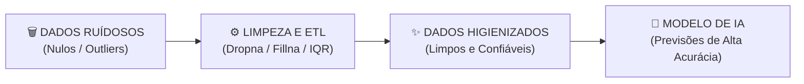

# Aula 04 - Preparação e Tratamento de Dados - Parte 1 (Limpeza, Nulos e Outliers)

**Disciplina:** Aprendizado de Máquina e Redes Neurais  
**Professor:** Eduardo Lázaro Roesler de Oliveira  
**Instituição:** UNIVEM — Centro Universitário de Marília  

---

> [!NOTE]
> 🔙 **De onde viemos:** Na Aula 03, aprendemos a navegar e explorar tabelas com a biblioteca Pandas.
> 🎯 **Objetivo Principal da Aula:** Identificar e realizar os primeiros tratamentos de falhas comuns em tabelas reais: valores ausentes `NaN`, duplicatas e valores muito distantes do restante dos dados (*outliers*).
> 🚀 **Para onde vamos:** Na próxima aula ('Preparação e Tratamento de Dados - Parte 2'), concluiremos o pré-processamento aplicando Normalização, Padronização e Encoders Categóricos.

---

## Organização Tática da Aula

| Módulo | Atividade | Foco Pedagógico |
| :--- | :--- | :--- |
| **Módulo 1** | **Fundamentação Teórica & Diagnóstico de Dados** | O impacto de dados ruidosos em ML, tipos de dados nulos e a Regra do IQR para outliers. |
| **Módulo 2** | **Estratégias de Imputação vs. Remoção** | Diagnosticar antes de alterar: duplicatas, nulos e escolhas entre `.dropna()` e `.fillna()`. |
| **Módulo 3** | **Prática Guiada no Google Colab** | 8 blocos de código em Python minuciosamente comentados linha por linha com caixas de dúvidas. |
| **Módulo 4** | **Prática Orientada & Experimentação Fácil** | Higienização de dados e detecção de "Cheaters" (outliers) em games online. |
| **Módulo 5** | **Checklist de Autonomia & Bibliografia** | Autoavaliação do estudante e referências oficiais. |

---

## Módulo 1: Fundamentação Teórica & Diagnóstico de Dados

### 1.1 O Princípio "Garbage In, Garbage Out" (GIGO)
Em Machine Learning, os algoritmos são essencialmente otimizadores matemáticos. Se fornecermos a eles um conjunto de dados contaminado por valores ausentes (`NaN`), duplicatas inconsistentes ou *outliers* aberrantes, o modelo aprenderá padrões distorcidos.

Estima-se que Cientistas de Dados dediquem de **60% a 80% do tempo de um projeto** exclusivamente às etapas de coleta, limpeza e preparação dos dados!



> [!TIP]
> 👾 **Analogia Geek — Detectando Cheaters / Hackers em Jogos Online:**
> Imagine que em um jogo de tiro online (como Counter-Strike ou Valorant) a média de abates por partida de um jogador normal seja entre 10 e 30. De repente, surge uma conta nova com **3.500 abates por partida**! Esse valor discrepante é um **Outlier** (e provavelmente um Cheater/Hacker). Se colocarmos esse dado no nosso modelo sem limpar, ele vai achar que 3.500 abates é algo normal e arruinar a pontuação de todos!

> [!NOTE]
> 💡 **Curiosidade da Aula — O Bug do Mariner 1 (Garbage In, Garbage Out):**
> Em **1962, a NASA lançou a sonda Mariner 1** em direção a Vênus. Poucos minutos após a decolagem, o foguete se desviou do curso e teve que ser destruído no ar. A causa? Um **único caractere traço (`-`) ausente** na especificação dos dados de entrada do software! Esse foi um dos erros de dados mais caros da história da ciência (custou mais de 80 milhões de dólares na época) e demonstrou a importância vital de validar e limpar os dados de entrada!  
> 🔗 **Documentação Pandas:** [pandas.DataFrame.fillna](https://pandas.pydata.org/pandas-docs/stable/reference/api/pandas.DataFrame.fillna.html)

> [!IMPORTANT]
> 💡 **Em 1 Frase:** O princípio GIGO estabelece que se inserirmos dados corrompidos ou ruidosos na entrada, o modelo de IA produzirá previsões erradas e não confiáveis na saída.

---

## Módulo 2: O Mecanismo por Dentro & Regras Práticas

### 2.1 Principais Métodos de Limpeza do Pandas

| Comando Pandas | O que faz no dataset | Quando utilizar |
| :--- | :--- | :--- |
| `df.isnull().sum()` | Conta a quantidade exata de `NaN` por coluna. | Diagnóstico inicial do dataset. |
| `df.dropna(subset=['col'])` | Deleta as linhas onde a coluna possui `NaN`. | Quando os nulos representam < 5% da base. |
| `df['col'].fillna(mediana)` | Preenche os `NaN` de uma coluna com a mediana. | Para preservar o tamanho do dataset sem distorcer. |
| `df.duplicated().sum()` | Identifica a presença de linhas exatamente idênticas. | Antes de qualquer treinamento para evitar viés. |
| `df.drop_duplicates()` | Remove as linhas repetidas mantendo a primeira ocorrência. | Limpeza obrigatória em pipelines de ETL. |

> [!IMPORTANT]
> 💡 **Em 1 Frase:** Preencher nulos com a Mediana preserva a quantidade total de linhas da tabela sem inflacionar as estatísticas por causa de valores extremos.

---

## Módulo 3: Prática Guiada no Google Colab

Abra o [Google Colab](https://colab.research.google.com), crie um novo Notebook e acompanhe os blocos de código abaixo.

> [!NOTE]
> **Roteiro da limpeza:** primeiro olhamos a tabela, depois contamos os problemas, removemos duplicatas, decidimos como tratar nulos e só então investigamos valores muito fora do padrão. Execute um bloco por vez; cada resultado será usado no próximo.

---

### Bloco 3.1 — Gerando um Dataset Ruidoso Simulado de Jogadores

> [!IMPORTANT]
> 🤔 **Dúvidas Comuns de Iniciantes:**  
> **O que é o valor `np.nan`?**  
> Significa *Not a Number* (Não é um Número). É a forma como o Python representa um dado que está faltando ou em branco em uma tabela.

> [!TIP]
> Antes de executar, procure `np.nan` no dicionário. Em qual coluna há um dado ausente? A resposta aparecerá novamente no diagnóstico do próximo bloco.

```python
# 1. Importamos as bibliotecas Pandas e NumPy
import pandas as pd
import numpy as np

# 2. Criamos um dicionário contendo falhas propositais: duplicatas, nulos e um outlier
dicionario_jogadores_ruidoso = {
    'player_id': [101, 102, 103, 104, 105, 102, 107], # ID 102 é DUPLICADO
    'nickname': ['Gamer1', 'Shadow', 'Dragon', 'Shadow', 'Valkyrie', 'Shadow', np.nan],
    'horas_jogadas': [45, 120, np.nan, 120, 80, 120, 30], # Um valor NaN em horas
    'pontos_partida': [1500, 3200, 2100, 3200, 2800, 3200, 999999] # 999999 é OUTLIER (Cheater)!
}

# 3. Convertemos o dicionário em um DataFrame Pandas
tabela_jogadores = pd.DataFrame(dicionario_jogadores_ruidoso)

# 4. Exibimos a tabela com ruídos no console
print("--- DATASET ORIGINAL COM NULOS, DUPLICATAS E CHEATER ---")
print(f"📐 Dimensão Inicial: {tabela_jogadores.shape[0]} linhas x {tabela_jogadores.shape[1]} colunas")
print("\nTabela com ruidos:")
print(tabela_jogadores)
```

---

### Bloco 3.2 — Diagnóstico Inicial de Valores Nulos (`isnull().sum()`)

> [!IMPORTANT]
> 🤔 **Dúvidas Comuns de Iniciantes:**  
> **O que faz a combinação `.isnull().sum()`?**  
> O `.isnull()` cria uma tabela de `True` (onde é nulo) e `False` (onde tem dado). O `.sum()` soma todos os `True` de cada coluna, revelando exatamente quantos nulos existem.

```python
# 1. Contamos a quantidade exata de valores nulos (NaN) em cada coluna da tabela
contagem_nulos_por_coluna = tabela_jogadores.isnull().sum()

# 2. Exibimos o relatório de nulos por coluna
print("--- DIAGNÓSTICO DE VALORES AUSENTES (NaN) ---")
print("Valores Ausentes por Coluna:\n", contagem_nulos_por_coluna)
```

---

### Bloco 3.3 — Detecção e Remoção de Duplicatas (`duplicated`)

> [!IMPORTANT]
> 🤔 **Dúvidas Comuns de Iniciantes:**  
> **O que faz o parâmetro `keep='first'`?**  
> Ele instrui o Pandas a manter a primeira vez que a linha apareceu na tabela e deletar apenas as repetições que vierem depois dela.

```python
# 1. Identificamos e contamos quantas linhas são exatamente idênticas a outras
quantidade_duplicatas = tabela_jogadores.duplicated().sum()

# 2. Removemos as linhas duplicadas mantendo a primeira ocorrência
tabela_sem_duplicatas = tabela_jogadores.drop_duplicates(keep='first').copy()

# 3. Exibimos o resultado no console
print("--- REMOÇÃO DE REGISTROS DUPLICADOS ---")
print(f"⚠️ Total de linhas duplicadas encontradas: {quantidade_duplicatas}")
print(f"✅ Duplicatas removidas! Linhas restantes na tabela: {len(tabela_sem_duplicatas)}")
```

---

### Bloco 3.4 — Remoção Direta de Nulos com `.dropna()`

> [!IMPORTANT]
> 🤔 **Dúvidas Comuns de Iniciantes:**  
> **Por que NUNCA devemos sair usando `.dropna()` sem pensar?**  
> Porque se a sua base for pequena ou tiver nulos espalhados em várias colunas, o `.dropna()` pode apagar metade da sua tabela e destruir informações valiosas!

```python
# 1. Removemos qualquer linha que contenha pelo menos um valor NaN em qualquer coluna
tabela_sem_nulos_direto = tabela_sem_duplicatas.dropna()

# 2. Exibimos quantas linhas restaram após a exclusão brutal
print("--- DEMONSTRAÇÃO DA REMOÇÃO DIRETA COM DROPNA ---")
print(f"Linhas restantes após dropna(): {len(tabela_sem_nulos_direto)}")
print(tabela_sem_nulos_direto)
```

---

### Bloco 3.5 — Imputação Estatística de Nulos (`fillna` com Mediana)

> [!IMPORTANT]
> 🤔 **Dúvidas Comuns de Iniciantes:**  
> **Por que usamos a Mediana em vez da Média para preencher números nulos?**  
> Porque a Média é facilmente "puxada" para cima por um valor gigante (outlier). A **Mediana** pega exatamente o valor central da lista ordenada e não se deixa enganar por números malucos!

```python
# 1. Calculamos a mediana da coluna 'horas_jogadas' (ignora automaticamente os nulos)
valor_mediana_horas = tabela_sem_duplicatas['horas_jogadas'].median()

# 2. Preenchemos os nulos da coluna com a mediana calculada
tabela_sem_duplicatas['horas_jogadas'] = tabela_sem_duplicatas['horas_jogadas'].fillna(valor_mediana_horas)

# 3. Exibimos a tabela com o valor preenchido
print("--- IMPUTAÇÃO DE VALORES NULOS COM MEDIANA ---")
print(f"📊 Mediana calculada para preenchimento: {valor_mediana_horas} horas")
print("\nTabela após imputação da Mediana:")
print(tabela_sem_duplicatas[['player_id', 'nickname', 'horas_jogadas']])
```

---

### Bloco 3.6 — Imputação Categórica com a Moda (`fillna` com Moda)

> [!IMPORTANT]
> 🤔 **Dúvidas Comuns de Iniciantes:**  
> **O que é a Moda (`.mode()`)?**  
> É o valor que **mais se repete** em uma coluna. Como não existe "média" para nomes ou palavras, usamos o apelido mais comum (Moda) para preencher textos vazios.

```python
# 1. Calculamos o apelido/texto mais frequente (Moda) da coluna 'nickname'
valor_moda_nickname = tabela_sem_duplicatas['nickname'].mode()[0]

# 2. Preenchemos o apelido ausente com a Moda calculada
tabela_sem_duplicatas['nickname'] = tabela_sem_duplicatas['nickname'].fillna(valor_moda_nickname)

# 3. Exibimos o resultado
print("--- IMPUTAÇÃO CATEGÓRICA COM MODA ---")
print(f"🗣️ Apelido mais comum (Moda): {valor_moda_nickname}")
```

---

### Bloco 3.7 — Cálculo dos Quartis (Q1, Q3) e do IQR

> [!IMPORTANT]
> 🤔 **Dúvidas Comuns de Iniciantes:**  
> **O que é o IQR (Interquartile Range)?**  
> É a distância entre os 25% mais baixos ($Q_1$) e os 75% mais altos ($Q_3$) dos seus dados. O IQR mede onde está concentrado o "miolo" normal das informações.

> [!NOTE]
> Este é um primeiro contato com IQR. O objetivo não é memorizar a fórmula, mas acompanhar o processo: encontrar o intervalo usual dos pontos e usar um limite para investigar valores muito distantes.

```python
# 1. Calculamos o primeiro quartil (25%) e o terceiro quartil (75%) da pontuação
quartil_1 = tabela_sem_duplicatas['pontos_partida'].quantile(0.25)
quartil_3 = tabela_sem_duplicatas['pontos_partida'].quantile(0.75)

# 2. Calculamos a Amplitude Interquartil (IQR = Q3 - Q1)
amplitude_iqr = quartil_3 - quartil_1

# 3. Exibimos os valores estatísticos calculados
print("--- CÁLCULO ESTATÍSTICO DO IQR PARA OUTLIERS ---")
print(f"Q1 (25% dos dados): {quartil_1}")
print(f"Q3 (75% dos dados): {quartil_3}")
print(f"Amplitude IQR:      {amplitude_iqr}")
```

---

### Bloco 3.8 — Remoção de Outliers via Limite Superior do IQR

> [!IMPORTANT]
> 🤔 **Dúvidas Comuns de Iniciantes:**  
> **Por que a fórmula do limite usa `1.5 * IQR`?**  
> É uma regra estatística clássica proposta por John Tukey para sinalizar valores que merecem investigação. Um valor acima de $Q_3 + 1.5 \times IQR$ é um candidato a outlier; antes de removê-lo, devemos avaliar se é erro, fraude ou um caso real importante.

```python
# 1. Definimos o limite superior máximo aceitável para pontuações normais
limite_superior_aceitavel = quartil_3 + 1.5 * amplitude_iqr

# 2. Filtramos a tabela mantendo apenas pontuações menores ou iguais ao limite aceitável
tabela_limpa_final = tabela_sem_duplicatas[tabela_sem_duplicatas['pontos_partida'] <= limite_superior_aceitavel].copy()

# 3. Exibimos a tabela higienizada sem o jogador hacker
print("--- FILTRAGEM DO JOGADOR HACKER (OUTLIER) ---")
print(f"🚨 Limite Superior Aceitável de Pontos: {limite_superior_aceitavel}")
print("\n🎉 TABELA FINAL COMPLETAMENTE HIGIENIZADA E SEM OUTLIERS:")
print(tabela_limpa_final)
```

---

## Módulo 4: Prática Orientada & Experimentação Fácil

### Roteiro de Personalização para o Estudante:
Altere o código de remoção de outliers do placar do jogo abaixo para personalizar o filtro:

1. **Altere o fator do multiplicador do IQR:** O padrão é `1.5`. Na linha `fator_multiplicador_iqr = 1.5`, mude para `1.0` ou `2.0`.
2. **Re-execute e observe:** Veja se o seu filtro elimina o jogador hacker sem apagar os jogadores de pontuação normal!

```python
# =============================================================================
# CÓDIGO BASE PRONTO PARA SUA EXPERIMENTAÇÃO
# =============================================================================
import pandas as pd

# 1. Tabela sintética com placar de jogos
tabela_placar_games = pd.DataFrame({
    'jogador': ['ProPlayer', 'Noob123', 'Hacker99', 'PlayerX', 'GamerBR'],
    'pontos': [4500, 1200, 950000, 3800, 2900] # 950.000 é um outlier evidente!
})

# -----------------------------------------------------------------------------
# STEP 1: PASSO DE EXPERIMENTAÇÃO DO ALUNO — ALTERE O FATOR MULTIPLICADOR DO IQR:
# -----------------------------------------------------------------------------
fator_multiplicador_iqr = 1.5 # Tente mudar para 1.0 ou 2.0 e veja o limite!

# 2. Calculamos os quartis e o limite superior
quartil_1 = tabela_placar_games['pontos'].quantile(0.25)
quartil_3 = tabela_placar_games['pontos'].quantile(0.75)
amplitude_iqr = quartil_3 - quartil_1

limite_superior_calculado = quartil_3 + fator_multiplicador_iqr * amplitude_iqr

# 3. Filtramos mantendo apenas pontuações normais
tabela_sem_hacker = tabela_placar_games[tabela_placar_games['pontos'] <= limite_superior_calculado]

# 4. Exibimos o placar higienizado
print(f"--- PLACAR HIGIENIZADO SEM HACKERS (Fator IQR = {fator_multiplicador_iqr}) ---")
print(tabela_sem_hacker)
```

---

## Módulo 5: Checklist de Autonomia do Estudante

- [ ] Compreendi a importância de tratar dados ruidosos antes do treinamento de ML.
- [ ] Sei diagnosticar nulos com `df.isnull().sum()`.
- [ ] Sei quando aplicar a remoção (`dropna`) ou imputação com Mediana/Moda (`fillna`).
- [ ] Dominei o uso do `drop_duplicates()`.
- [ ] Consigo alterar o fator do IQR e observar como o limite de investigação muda.

---

## Referências Bibliográficas & Documentações Oficiais

- 📖 **Livro Texto:** Géron, A. — *Mãos à Obra: Aprendizado de Máquina com Scikit-Learn, Keras & TensorFlow* (Capítulo 2: Limpeza de Dados).
- 🔗 **Documentação Pandas:** [pandas Working with missing data](https://pandas.pydata.org/pandas-docs/stable/user_guide/missing_data.html)
