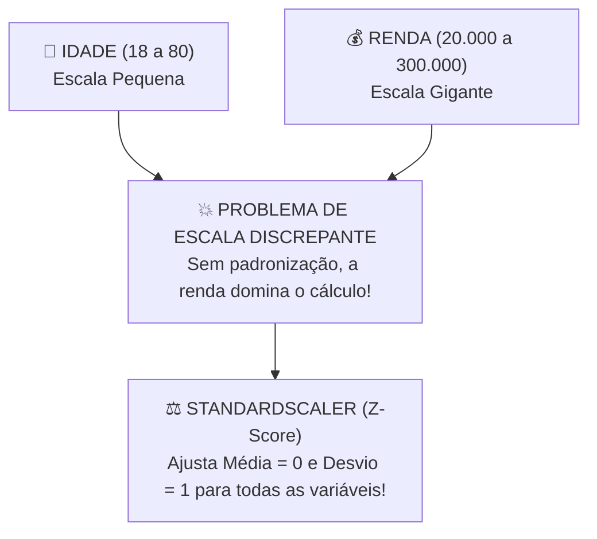

# Aula 05 - Preparação e Tratamento de Dados - Parte 2 (Feature Engineering, Scaling & Encoding)

**Disciplina:** Aprendizado de Máquina e Redes Neurais  
**Professor:** Eduardo Lázaro Roesler de Oliveira  
**Instituição:** UNIVEM — Centro Universitário de Marília  

---

> [!NOTE]
> 🔙 **De onde viemos:** Na Aula 04, limpamos os dados eliminando valores nulos, registros duplicados e outliers. Porém, algoritmos de Machine Learning operam estritamente sobre matrizes numéricas homogêneas: eles são incapazes de realizar operações matemáticas sobre textos (como cidades ou categorias) e sofrem distorções severas quando uma coluna está em milhares (Salário) e outra em unidades (Idade).
> 🎯 **Objetivo Principal da Aula:** Dominar a transformação de dados categóricos em numéricos (**Mapeamento Ordinal** e **One-Hot Encoding**) e reescalar atributos contínuos para a mesma faixa de grandeza (**StandardScaler** e **MinMaxScaler**).
> 🚀 **Para onde vamos:** Na próxima aula ('Visualização de Dados'), utilizaremos todo o nosso conjunto de dados já limpo e transformado para gerar gráficos reveladores com **Matplotlib & Seaborn**, identificando correlações ocultas e padrões visuais antes de criarmos nosso primeiro modelo preditivo.

---

## Organização Tática da Aula

| Módulo | Atividade | Foco Pedagógico |
| :--- | :--- | :--- |
| **Módulo 1** | **Fundamentação Teórica & Por que Transformar?** | A necessidade de conversão de texto para números e o problema de escalas discrepantes. |
| **Módulo 2** | **Técnicas de Encoding e Scaling no Scikit-Learn** | Label vs. One-Hot Encoding e a diferença entre StandardScaler (Z-Score) e MinMaxScaler ($0$ a $1$). |
| **Módulo 3** | **Prática Guiada no Google Colab** | 7 blocos de código em Python minuciosamente comentados linha por linha com caixas de dúvidas. |
| **Módulo 4** | **Prática Orientada & Experimentação Fácil** | Padronização vs Normalização dos atributos de guerreiros/atletas. |
| **Módulo 5** | **Checklist de Autonomia & Bibliografia** | Autoavaliação do estudante e referências oficiais. |

---

## Módulo 1: Fundamentação Teórica & Transformação de Dados

### 1.1 Por que Algoritmos de ML Exigem Números e Mesma Escala?
Os algoritmos de Machine Learning operam internamente através de **multiplicações matriciais** e **cálculo de distâncias euclidianas**. Isso impõe duas grandes necessidades:

1. **Computabilidade:** Computadores não conseguem aplicar equações em strings textuais como `"Baixo"`, `"Médio"`, `"Alto"`. Precisamos codificar textos em números.
2. **Equilíbrio de Escalas:** Considere duas variáveis de um cliente:
   - `Idade`: Varia de 18 a 80 (escala de dezenas).
   - `Renda_Anual`: Varia de R$ 20.000 a R$ 300.000 (escala de centenas de milhares).

Se passarmos esses dados sem tratamento para um modelo baseado em distância (como KNN ou Regressão), a variável `Renda_Anual` dominará o cálculo matemático por causa de sua magnitude, tornando a `Idade` praticamente "invisível" para a máquina!



> [!TIP]
> ⚔️ **Analogia Geek — Equilibrando Status de Cavaleiros do Zodíaco / Animes:**
> Se tentarmos comparar o poder de dois heróis olhando para a variável `Cosmo/Ki` (variação de 1.000 a 1.000.000) e a variável `Velocidade_Mach` (variação de 1 a 10), o algoritmo achará que a velocidade não serve para nada só porque o número é menor! O **StandardScaler** coloca todas as estatísticas no mesmo "ringue justo", ajustando a Média para 0 e o Desvio Padrão para 1!

> [!NOTE]
> 💡 **Curiosidade da Aula — O Impacto no ImageNet e Visão Computacional:**
> Em **2012, a famosa rede neural AlexNet** venceu o desafio internacional ImageNet de visão computacional. Um dos segredos cruciais foi a **normalização de pixels** de todas as imagens para o intervalo estrito entre 0.0 e 1.0 antes de passar pelas camadas de convolução. Sem o escalonamento de atributos, os gradientes explodiam durante o treinamento e a rede não conseguia aprender!  
> 🔗 **Documentação Oficial Scikit-Learn:** [scikit-learn Preprocessing data](https://scikit-learn.org/stable/modules/preprocessing.html)

> [!IMPORTANT]
> 💡 **Em 1 Frase:** O escalonamento de dados ajusta todas as variáveis para uma mesma ordem de grandeza, impedindo que colunas com números gigantes dominem injustamente o aprendizado do modelo.

---

## Módulo 2: O Mecanismo por Dentro & Regras Práticas

### 2.1 Comparativo das Técnicas de Codificação Categórica (*Encoding*)

| Técnica | Como Funciona | Quando Utilizar | Cuidados |
| :--- | :--- | :--- | :--- |
| **Label / Ordinal Encoder** | Converte cada categoria em um número inteiro ($0, 1, 2, 3$). | Variáveis Categóricas **Ordinais** (onde existe hierarquia: Peq, Med, Gde). | Não usar em categorias nominais sem ordem (ex: Cores), pois o modelo achará que $3 > 1$. |
| **One-Hot Encoder (Dummy)** | Cria uma nova coluna binária ($0$ ou $1$) para cada categoria única. | Variáveis Categóricas **Nominais** (sem hierarquia: Cidades, Gênero). | Pode aumentar muito o número de colunas (Mal da Dimensionalidade). |

### 2.2 Comparativo das Técnicas de Escalonamento Numérico (*Feature Scaling*)

1. **StandardScaler (Padronização / Z-Score):** Transforma os dados para terem Média = $0$ e Desvio Padrão = $1$.
   $$z = \frac{x - \mu}{\sigma}$$
2. **MinMaxScaler (Normalização):** Escala todos os dados exatamente para o intervalo estrito entre $0$ e $1$.
   $$x_{norm} = \frac{x - x_{min}}{x_{max} - x_{min}}$$

> [!IMPORTANT]
> 💡 **Em 1 Frase:** Use Mapeamento Ordinal para categorias hierárquicas (Baixo/Médio/Alto), One-Hot Encoding para nomes sem ordem, e StandardScaler para igualar a escala de números contínuos.

---

## Módulo 3: Prática Guiada no Google Colab

Abra o [Google Colab](https://colab.research.google.com), crie um novo Notebook e acompanhe os blocos de código abaixo.

> [!NOTE]
> **Roteiro de estudo:** execute um bloco por vez e preserve os nomes das variáveis. Primeiro veja os dados brutos; depois acompanhe cada transformação. `map`, One-Hot e escalonadores são primeiros contatos: o importante agora é perceber como uma coluna muda para ficar utilizável pelo modelo.

---

### Bloco 3.1 — Criando um Dataset Bruto com Atributos Heterogêneos

> [!IMPORTANT]
> 🤔 **Dúvidas Comuns de Iniciantes:**  
> **O que significa dizer que um dataset tem atributos heterogêneos?**  
> Significa que a tabela mistura colunas de textos nominais (sem ordem), textos ordinais (com hierarquia) e colunas numéricas em escalas imensamente diferentes (ex: centenas de milhares vs. dezenas).

```python
# 1. Importamos as bibliotecas fundamentais
import pandas as pd
import numpy as np
from sklearn.preprocessing import StandardScaler, MinMaxScaler

# 2. Criamos um dataset simulado com personagens e atributos heterogêneos
dicionario_herois = {
    'heroi': ['Goku', 'Vegeta', 'Gohan', 'Piccolo', 'Kuririn'],
    'classe': ['Saiyajin', 'Saiyajin', 'Híbrido', 'Namekuseijin', 'Humano'], # Categórica Nominal
    'patente': ['Baixa', 'Alta', 'Alta', 'Média', 'Baixa'],                 # Categórica Ordinal
    'nivel_poder': [900000, 850000, 700000, 450000, 80000],                 # Numérica Grande
    'velocidade_mach': [15, 14, 12, 9, 4]                                   # Numérica Pequena
}

# 3. Convertemos o dicionário em um DataFrame Pandas
tabela_herois = pd.DataFrame(dicionario_herois)

# 4. Exibimos o dataset bruto no console
print("--- DATASET BRUTO DE HERÓIS ---")
print(f"📐 Dimensão: {tabela_herois.shape[0]} linhas x {tabela_herois.shape[1]} colunas")
print("\nTabela com dados não-tratados:")
print(tabela_herois)
```

---

### Bloco 3.2 — Mapeamento Ordinal Manual via Dicionário (`map`)

> [!IMPORTANT]
> 🤔 **Dúvidas Comuns de Iniciantes:**  
> **Por que usamos um mapeamento manual para a coluna `patente`?**  
> Porque a patente possui uma ordem lógica implícita (`Baixa < Média < Alta`). Atribuir manualmente os números `1, 2, 3` preserva essa relação matemática no modelo.

```python
# 1. Criamos um dicionário manual definindo a ordem explícita (Baixa=1, Média=2, Alta=3)
dicionario_mapeamento_patente = {'Baixa': 1, 'Média': 2, 'Alta': 3}

# 2. Aplicamos o mapeamento na coluna 'patente' criando uma nova coluna 'patente_encoded'
tabela_herois['patente_encoded'] = tabela_herois['patente'].map(dicionario_mapeamento_patente)

# 3. Exibimos a comparação entre a coluna original em texto e a coluna codificada
print("--- VARIÁVEL ORDINAL MAPEADA ---")
print(tabela_herois[['heroi', 'patente', 'patente_encoded']])
```

---

### Bloco 3.3 — Codificação Nominal via One-Hot Encoding (`pd.get_dummies`)

> [!IMPORTANT]
> 🤔 **Dúvidas Comuns de Iniciantes:**  
> **Por que NUNCA devemos usar números ordenados `0, 1, 2` para categorias nominais (como raça/classe)?**  
> Porque se codificarmos Saiyajin=0, Híbrido=1 e Namekuseijin=2, a máquina achará que Namekuseijin é "duas vezes maior" que Saiyajin! O One-Hot Encoding cria colunas separadas de $0$ ou $1$ (*dummies*) resolvendo o erro.

```python
# 1. Aplicamos pd.get_dummies para criar colunas binárias para cada classe de herói
tabela_dummies_classe = pd.get_dummies(tabela_herois['classe'], prefix='classe', dtype=int)

# 2. Concatenamos as novas colunas binárias com a tabela original
tabela_herois_encoded = pd.concat([tabela_herois, tabela_dummies_classe], axis=1)

# 3. Exibimos as colunas binárias geradas
print("--- COLUNAS ONE-HOT DUMMIES GERADAS ---")
print(tabela_dummies_classe)
```

---

### Bloco 3.4 — Instanciando o `StandardScaler` do Scikit-Learn

> [!IMPORTANT]
> 🤔 **Dúvidas Comuns de Iniciantes:**  
> **O que o `StandardScaler` faz com os números?**  
> Ele recalcula todos os números para que a nova média seja **exatamente $0$** e o novo desvio padrão seja **exatamente $1$** (cálculo do Z-Score).

```python
# 1. Selecionamos os nomes das colunas numéricas que estão em escalas discrepantes
colunas_numericas = ['nivel_poder', 'velocidade_mach']

# 2. Instanciamos o objeto escalonador padronizado (StandardScaler)
escalonador_padronizado = StandardScaler()

# 3. Exibimos os números originais desproporcionais antes da padronização
print("--- VALORES ORIGINAIS ANTES DO ESCALONAMENTO ---")
print("Valores originais de Poder:     ", tabela_herois['nivel_poder'].values)
print("Valores originais de Velocidade:", tabela_herois['velocidade_mach'].values)
```

---

### Bloco 3.5 — Aplicando `fit_transform` com `StandardScaler`

> [!IMPORTANT]
> 🤔 **Dúvidas Comuns de Iniciantes:**  
> **O que faz o método `.fit_transform()`?**  
> O `.fit()` calcula a média ($\mu$) e o desvio padrão ($\sigma$) das colunas numéricas. O `.transform()` aplica a fórmula do Z-Score em cada número. O `.fit_transform()` faz ambas as etapas de uma só vez!

```python
# 1. Executamos fit_transform para calcular a média/desvio e transformar as colunas numéricas
matriz_dados_padronizados = escalonador_padronizado.fit_transform(tabela_herois_encoded[colunas_numericas])

# 2. Convertemos a matriz resultante de volta em um DataFrame Pandas com novos cabeçalhos
tabela_padronizada = pd.DataFrame(matriz_dados_padronizados, columns=['poder_padronizado', 'velocidade_padronizada'])

# 3. Exibimos a tabela com os números padronizados
print("--- RESULTADO APÓS STANDARDSCALER (Média=0, Desvio=1) ---")
print(tabela_padronizada.round(2))

# 4. Verificamos se a média realmente virou 0 e o desvio padrão virou 1
print(f"\n📊 Média calculada do Poder:    {tabela_padronizada['poder_padronizado'].mean():.2f}")
print(f"📊 Desvio Padrão do Poder:       {tabela_padronizada['poder_padronizado'].std():.2f}")
```

---

### Bloco 3.6 — Instanciando e Aplicando o `MinMaxScaler`

> [!IMPORTANT]
> 🤔 **Dúvidas Comuns de Iniciantes:**  
> **Qual a diferença entre `StandardScaler` e `MinMaxScaler`?**  
> - `StandardScaler`: centra os dados no $0$ e permite números negativos ou maiores que $1$ (ideal para modelos sensíveis a outliers).  
> - `MinMaxScaler`: espreme rigorosamente todos os números entre $0.0$ e $1.0$ (ideal para redes neurais e processamento de imagens/pixels).

```python
# 1. Instanciamos o objeto escalonador MinMax (Normalização entre 0 e 1)
escalonador_minmax = MinMaxScaler()

# 2. Aplicamos a transformação para reescalar todas as colunas numéricas para o intervalo [0, 1]
matriz_dados_minmax = escalonador_minmax.fit_transform(tabela_herois_encoded[colunas_numericas])

# 3. Convertemos a matriz em um DataFrame com nomes de colunas apropriados
tabela_minmax = pd.DataFrame(matriz_dados_minmax, columns=['poder_minmax', 'velocidade_minmax'])

# 4. Exibimos o resultado normalizado no console
print("--- RESULTADO APÓS MINMAXSCALER (Intervalo Estrito entre 0 e 1) ---")
print(tabela_minmax.round(2))
```

---

### Bloco 3.7 — Montando a Matriz Final Pronta para Machine Learning

> [!IMPORTANT]
> 🤔 **Dúvidas Comuns de Iniciantes:**  
> **Por que juntamos as colunas com `axis=1` no `pd.concat`?**  
> O argumento `axis=1` instrui o Pandas a colar as novas colunas de forma **horizontal** (lado a lado), formando a matriz de entrada completa $X$ contendo apenas números!

```python
# 1. Unimos as colunas encodadas e escaladas em um DataFrame final X usando concatenação horizontal (axis=1)
matriz_entradas_final = pd.concat([
    tabela_herois['patente_encoded'],
    tabela_dummies_classe,
    tabela_padronizada
], axis=1)

# 2. Exibimos a matriz de entrada final limpa e pronta para alimentarmos o algoritmo de IA
print("--- MATRIZ FINAL X PRONTA PARA TREINAMENTO DE IA ---")
print(f"📐 Dimensão Final da Matriz de Entrada X: {matriz_entradas_final.shape}")
print(matriz_entradas_final.round(2))
```

---

## Módulo 4: Prática Orientada & Experimentação Fácil

### Roteiro de Personalização para o Estudante:
Altere a escolha do escalonador de dados no código abaixo para ver como os números se transformam:

1. **Altere o escalonador:** O código usa `StandardScaler()`. Na linha `meu_escalonador_escolhido = StandardScaler()`, mude para `MinMaxScaler()` e rode!
2. **Re-execute e observe:** Veja como com o `MinMaxScaler()` todos os números ficam espremidos rigorosamente entre 0.0 e 1.0!

```python
# =============================================================================
# CÓDIGO BASE PRONTO PARA SUA EXPERIMENTAÇÃO
# =============================================================================
import pandas as pd
from sklearn.preprocessing import StandardScaler, MinMaxScaler

# 1. Tabela sintética de atletas com força e salários discrepantes
tabela_atletas = pd.DataFrame({
    'forca': [85, 92, 78, 65],
    'salario_mensal': [15000, 85000, 22000, 9500]
})

# -----------------------------------------------------------------------------
# STEP 1: PASSO DE EXPERIMENTAÇÃO DO ALUNO — ALTERE O ESCALONADOR ABAIXO:
# -----------------------------------------------------------------------------
meu_escalonador_escolhido = StandardScaler() # Tente mudar para MinMaxScaler()

# 2. Aplicamos a transformação aos dados numéricos dos atletas
matriz_dados_escalados = meu_escalonador_escolhido.fit_transform(tabela_atletas)
tabela_escalada_final = pd.DataFrame(matriz_dados_escalados, columns=['forca_escalada', 'salario_escalado'])

# 3. Exibimos o relatório com os números transformados
print("--- DADOS APÓS SEU ESCALONAMENTO PERSONALIZADO ---")
print(tabela_escalada_final.round(3))
```

---

### 🔮 Aquecimento & Spoiler da Próxima Aula (Para Ir Além)

> [!TIP]
> 🧠 **Conceito-Semente — O poder de enxergar antes de prever**  
> Olhar para uma tabela com 50 colunas e 10.000 linhas numéricas é cansativo e confuso para o cérebro humano. Na **Aula 06**, aprenderemos a transformar tabelas em gráficos profissionais com **Matplotlib e Seaborn**: veremos como um *Heatmap* de correlação nos mostra em 2 segundos quais variáveis andam juntas e como um *Scatter Plot* revela agrupamentos naturais.
> 
> 🚀 **Desafio Proativo de Autoestudo (Opcional):**  
> No Google Colab, importe `import seaborn as sns; sns.get_dataset_names()` para ver dezenas de bases gratuitas que já vêm prontas para você explorar graficamente na próxima aula!

---

## Módulo 5: Checklist de Autonomia do Estudante

- [ ] Compreendi a diferença entre variáveis categóricas ordinais e nominais.
- [ ] Sei utilizar mapeamentos explícitos (`.map`) e `pd.get_dummies` para encodar texto.
- [ ] Entendi por que a desproporção de escalas numéricas prejudica modelos de ML.
- [ ] Dominei o uso do `StandardScaler` e `MinMaxScaler` do Scikit-Learn.
- [ ] Consigo alterar o tipo de escalonador no código e observar o resultado.

---

## Referências Bibliográficas & Documentações Oficiais

- 📖 **Livro Texto:** Géron, A. — *Mãos à Obra: Aprendizado de Máquina com Scikit-Learn, Keras & TensorFlow* (Capítulo 2: Pré-processamento e Pipelines).
- 🔗 **Documentação Scikit-Learn:** [scikit-learn Preprocessing data](https://scikit-learn.org/stable/modules/preprocessing.html)
