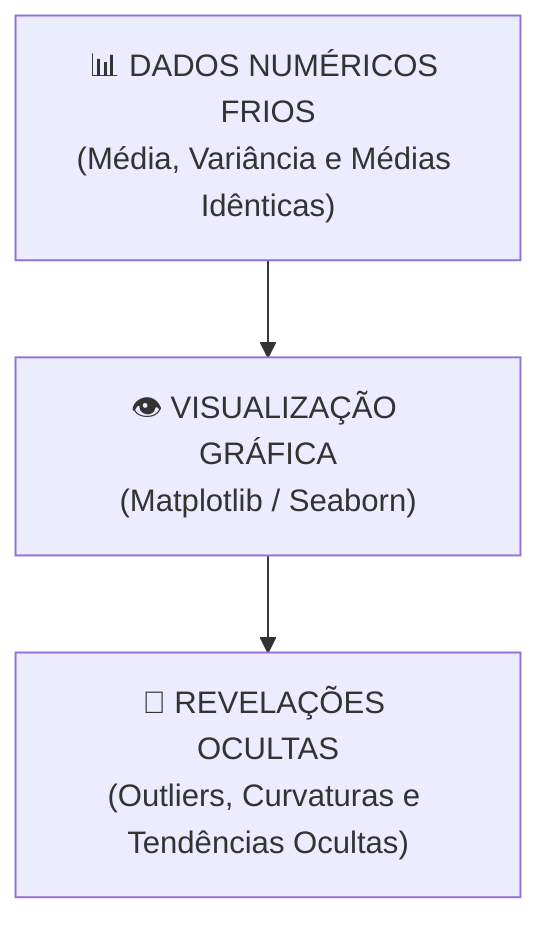

# Aula 06 - Visualização de Dados (Matplotlib & Seaborn)

**Disciplina:** Aprendizado de Máquina e Redes Neurais  
**Professor:** Eduardo Lázaro Roesler de Oliveira  
**Instituição:** UNIVEM — Centro Universitário de Marília  

---

> [!NOTE]
> 🔙 **De onde viemos:** Nas Aulas 04 e 05, deixamos nossos dados perfeitamente limpos, encodados e padronizados. Mas antes de gastar tempo treinando modelos complexos, precisamos entender o comportamento das variáveis, suas distribuições e como elas se correlacionam.
> 🎯 **Objetivo Principal da Aula:** Dominar as principais técnicas de **Visualização de Dados e Análise Exploratória (EDA)** com **Matplotlib** e **Seaborn**, construindo Histogramas, Boxplots, Scatter Plots com diferenciação de classes (`hue`) e Mapas de Calor de Correlação de Pearson (`heatmap`).
> 🚀 **Para onde vamos:** Na próxima aula ('Aprendizado Supervisionado - Parte 1'), daremos o grande salto da disciplina: encerraremos a fase de apenas 'olhar para o passado' e treinaremos nosso **primeiro modelo de Machine Learning (Regressão Linear)**, aprendendo a dividir os dados entre o material de estudo (**Treino**) e o dia da prova (**Teste**).

---

## Organização Tática da Aula

| Módulo | Atividade | Foco Pedagógico |
| :--- | :--- | :--- |
| **Módulo 1** | **Fundamentação Teórica & Narrativa Visual** | Por que gráficos revelam o que tabelas escondem (Quarteto de Anscombe) e a escolha do gráfico certo. |
| **Módulo 2** | **Tipologias Gráficas & Matriz de Correlação** | Histograma, KDE, Boxplot (detectando outliers), Scatter Plot (Hue) e Heatmap de Pearson. |
| **Módulo 3** | **Prática Guiada no Google Colab** | 8 blocos de código em Python minuciosamente comentados linha por linha com caixas de dúvidas. |
| **Módulo 4** | **Prática Orientada & Experimentação Fácil** | Customização gráfica de mapas de calor e paletas de cores do Seaborn. |
| **Módulo 5** | **Checklist de Autonomia & Bibliografia** | Autoavaliação do estudante e referências oficiais. |

---

## Módulo 1: Fundamentação Teórica & Narrativa Visual

### 1.1 O Quarteto de Anscombe e a Força da Visualização
Em 1973, o estatístico Francis Anscombe demonstrou quatro conjuntos de dados diferentes que possuíam exatamente a **mesma Média**, a **mesma Variância** e a **mesma Correlação Linear**. No entanto, quando plotados em um gráfico, os quatro conjuntos revelavam comportamentos completamente distintos!

Visualizar os dados antes de treinar qualquer modelo de IA é a única garantia de entender a distribuição real das variáveis.



> [!TIP]
> 🎨 **Analogia Geek — O HUD (Heads-Up Display) do Homem de Ferro / Jogos:**
> Olhar para uma tabela com 5.000 linhas de números é como olhar para um monte de linhas de código binário na Matrix. Quando colocamos esses dados em um gráfico do **Seaborn**, ativamos a "visão tática do Homem de Ferro (JARVIS/FRIDAY)": identificamos anomalias, picos de poder e tendências instantaneamente em cores vibrantes!

> [!NOTE]
> 💡 **Curiosidade da Aula — O "Datasaurus Dozen":**
> Em **2017, Justin Matejka e George Fitzmaurice** levaram o experimento de Anscombe ainda mais longe! Eles criaram 13 conjuntos de dados com médias e desvios padrão idênticos até a 2ª casa decimal. Um dos gráficos formava a **silhueta perfeita de um T-Rex (Dinosaur)**! Isso prova conclusivamente: NUNCA confie apenas em números sem olhar o gráfico!  
> 🔗 **Galeria Oficial do Seaborn:** [seaborn.pydata.org/examples](https://seaborn.pydata.org/examples/index.html)

> [!IMPORTANT]
> 💡 **Em 1 Frase:** Resumos estatísticos numéricos podem mentir ou esconder padrões; apenas a visualização gráfica revela a verdadeira distribuição e formato dos seus dados.

---

## Módulo 2: O Mecanismo por Dentro & Escolha do Gráfico Certo

### 2.1 Guia Rápido de Escolha Gráfica para Ciência de Dados

| Objetivo da Análise | Tipo de Variável | Gráfico Recomendado | Função Seaborn / Matplotlib |
| :--- | :--- | :--- | :--- |
| **Distribuição de 1 Variável** | Numérica Contínua | Histograma com KDE | `sns.histplot(..., kde=True)` |
| **Detecção Visual de Outliers** | Numérica por Categoria | Boxplot | `sns.boxplot(x='cat', y='num')` |
| **Relação entre 2 Variáveis** | Numérica vs. Numérica | Scatter Plot (Dispersão) | `sns.scatterplot(x='x', y='y')` |
| **Correlação entre N Variáveis**| Matriz de Variáveis Numéricas | Heatmap (Mapa de Calor) | `sns.heatmap(df.corr(), annot=True)`|

> [!IMPORTANT]
> 💡 **Em 1 Frase:** Escolha Histogramas para entender distribuições individuais, Boxplots para detectar outliers por categoria, Scatter Plots para medir relações X vs Y e Heatmaps para mapear correlações.

---

## Módulo 3: Prática Guiada no Google Colab

Abra o [Google Colab](https://colab.research.google.com), crie um novo Notebook e acompanhe os blocos de código abaixo.

> [!NOTE]
> **Roteiro de estudo:** em cada gráfico, faça duas perguntas antes de avançar: “o que está em cada eixo?” e “qual padrão consigo enxergar?”. Não é necessário decorar todos os parâmetros de Matplotlib e Seaborn; use os exemplos como modelos e concentre-se na interpretação visual.

---

### Bloco 3.1 — Configuração Estética Global do Seaborn

> [!IMPORTANT]
> 🤔 **Dúvidas Comuns de Iniciantes:**  
> **Por que definimos o tema estético `sns.set_theme()` no início?**  
> Para padronizar a identidade visual de todos os gráficos gerados no notebook, adicionando grade de fundo e paletas de cores elegantes sem precisar repetir comandos em cada bloco.

```python
# 1. Importamos as bibliotecas visuais Matplotlib e Seaborn
import matplotlib.pyplot as plt
import seaborn as sns
import pandas as pd
from sklearn.datasets import load_iris

# 2. Configuramos o tema estético global do Seaborn com fundo quadriculado limpo
sns.set_theme(style="whitegrid", palette="muted")

# 3. Definimos a dimensão padrão de todas as figuras (9 polegadas de largura x 5 de altura)
plt.rcParams['figure.figsize'] = (9, 5)

# 4. Exibimos a mensagem de confirmação da configuração visual
print("--- CONFIGURAÇÃO GRÁFICA DO SEABORN ---")
print("✅ Estilo 'whitegrid' e paleta 'muted' aplicados globalmente!")
```

---

### Bloco 3.2 — Carregando e Preparando o Iris Dataset

> [!IMPORTANT]
> 🤔 **Dúvidas Comuns of Iniciantes:**  
> **Por que convertemos o array numérico de classes em categorias nominais?**  
> Para que os gráficos do Seaborn exibam legendas legíveis com os nomes científicos das flores (`setosa`, `versicolor`, `virginica`) em vez de códigos numéricos frios (`0, 1, 2`).

```python
# 1. Carregamos o dataset bruto do Iris no Scikit-Learn
dados_brutos_iris = load_iris()

# 2. Criamos o DataFrame Pandas com as 4 colunas de características
tabela_iris = pd.DataFrame(dados_brutos_iris.data, columns=dados_brutos_iris.feature_names)

# 3. Adicionamos a coluna categórica mapeando os nomes reais das espécies de flores
tabela_iris['especie'] = pd.Categorical.from_codes(dados_brutos_iris.target, dados_brutos_iris.target_names)

# 4. Exibimos os primeiros 5 registros da tabela preparada
print("--- TABELA IRIS PRONTA PARA ANÁLISE VISUAL ---")
print(f"📐 Dimensão: {tabela_iris.shape[0]} amostras por {tabela_iris.shape[1]} colunas")
print(tabela_iris.head())
```

---

### Bloco 3.3 — Plotando Histograma Simples com Matplotlib

> [!IMPORTANT]
> 🤔 **Dúvidas Comuns de Iniciantes:**  
> **O que é o parâmetro `bins` no Histograma?**  
> `bins` indica o número de **faixas ou colunas verticais** em que a faixa de valores será dividida para contar a frequência dos dados.

```python
# 1. Criamos a figura do Matplotlib com dimensão 8x4.5 polegadas
plt.figure(figsize=(8, 4.5))

# 2. Desenhamos o histograma básico de barras para a coluna 'sepal length (cm)'
plt.hist(tabela_iris['sepal length (cm)'], bins=12, color='skyblue', edgecolor='black')

# 3. Adicionamos os títulos e rótulos explicativos dos eixos
plt.title("Histograma Simples — Comprimento da Sépala (Matplotlib)", fontweight='bold')
plt.xlabel("Comprimento da Sépala (cm)")
plt.ylabel("Frequência de Ocorrência")

# 4. Exibimos a figura no Google Colab
print("🎨 Gerando o histograma simples no Colab...")
plt.show()
```

---

### Bloco 3.4 — Histograma com Curva de Densidade KDE (Seaborn)

> [!IMPORTANT]
> 🤔 **Dúvidas Comuns de Iniciantes:**  
> **O que é a curva KDE (`kde=True`)?**  
> Significa *Kernel Density Estimate* (Estimativa de Densidade de Kernel). É a linha suave traçada sobre as barras do histograma que mostra o formato estatístico da distribuição contínua.

```python
# 1. Definimos o tamanho da figura gráfica
plt.figure(figsize=(9, 5))

# 2. Plotamos o histograma do Seaborn ativando a curva de densidade suave kde=True
sns.histplot(data=tabela_iris, x='sepal width (cm)', kde=True, color='teal', bins=15)

# 3. Adicionamos títulos legíveis ao gráfico
plt.title("Distribuição da Largura da Sépala (Com Curva de Densidade KDE)", fontweight='bold')
plt.xlabel("Largura da Sépala (cm)")
plt.ylabel("Contagem de Amostras")

# 4. Renderizamos o gráfico no console
print("🎨 Gerando o histograma com curva de densidade KDE...")
plt.show()
```

---

### Bloco 3.5 — Boxplot para Identificação de Outliers por Categoria

> [!IMPORTANT]
> 🤔 **Dúvidas Comuns de Iniciantes:**  
> **Como ler um Boxplot?**  
> A linha dentro da caixa representa a **Mediana**. A caixa contém o "miolo" central de 50% dos dados ($Q_1$ a $Q_3$). Os traços externos são as hastes e os **pontos isolados além das hastes são os outliers**!

```python
# 1. Definimos o tamanho do gráfico
plt.figure(figsize=(9, 5))

# 2. Desenhamos o Boxplot relacionando a categoria da espécie (X) com a variável numérica (Y)
sns.boxplot(data=tabela_iris, x='especie', y='sepal length (cm)', palette='Set2')

# 3. Adicionamos títulos explicativos
plt.title("Comparação da Sépala por Espécie (Com Boxplot)", fontweight='bold')
plt.xlabel("Espécie de Flor")
plt.ylabel("Comprimento da Sépala (cm)")

# 4. Exibimos a imagem gráfica
print("🎨 Gerando o Boxplot para identificação de outliers por categoria...")
plt.show()
```

---

### Bloco 3.6 — Gráfico de Dispersão (*Scatter Plot*) com Múltiplos Atributos (`hue`)

> [!IMPORTANT]
> 🤔 **Dúvidas Comuns de Iniciantes:**  
> **O que faz a propriedade `hue='especie'`?**  
> A propriedade `hue` (matiz/cor) instrui o Seaborn a **colorir cada ponto do gráfico** de acordo com a categoria daquela linha, permitindo visualizar agrupamentos e separação de classes.

```python
# 1. Definimos o tamanho da figura
plt.figure(figsize=(9, 5.5))

# 2. Desenhamos a dispersão X vs Y colorindo os pontos com hue='especie' e mudando formas com style='especie'
sns.scatterplot(
    data=tabela_iris, 
    x='petal length (cm)', 
    y='petal width (cm)', 
    hue='especie', 
    style='especie', 
    s=90 # Tamanho destacado dos pontos no gráfico
)

# 3. Adicionamos os rótulos aos eixos do gráfico
plt.title("Relação entre Comprimento e Largura da Pétala", fontweight='bold')
plt.xlabel("Comprimento da Pétala (cm)")
plt.ylabel("Largura da Pétala (cm)")

# 4. Renderizamos o gráfico no notebook
print("🎨 Gerando o Scatter Plot colorido por espécie de flor...")
plt.show()
```

---

### Bloco 3.7 — Cálculo da Matriz de Correlação de Pearson (`df.corr()`)

> [!IMPORTANT]
> 🤔 **Dúvidas Comuns de Iniciantes:**  
> **Como interpretar os valores da Correlação de Pearson?**  
> - Próximo de $+1.0$: Correlação positiva forte (quando $X$ sobe, $Y$ também sobe).  
> - Próximo de $-1.0$: Correlação negativa forte (quando $X$ sobe, $Y$ cai).  
> - Próximo de $0.0$: Sem nenhuma relação linear visível entre as duas variáveis.

```python
# 1. Selecionamos apenas os nomes das 4 colunas numéricas de medição
colunas_numericas = ['sepal length (cm)', 'sepal width (cm)', 'petal length (cm)', 'petal width (cm)']

# 2. Calculamos a matriz de correlação de Pearson entre todas as combinações de colunas
matriz_correlacao_pearson = tabela_iris[colunas_numericas].corr()

# 3. Exibimos a matriz numérica no console com arredondamento para 2 casas decimais
print("--- MATRIZ DE CORRELAÇÃO DE PEARSON (-1.0 a +1.0) ---")
print(matriz_correlacao_pearson.round(2))
```

---

### Bloco 3.8 — Plotando o Mapa de Calor de Correlação (*Heatmap*)

> [!IMPORTANT]
> 🤔 **Dúvidas Comuns de Iniciantes:**  
> **O que faz o parâmetro `annot=True` no Heatmap?**  
> O `annot=True` escreve o número exato do valor da correlação dentro de cada quadrado colorido do mapa de calor.

```python
# 1. Definimos o tamanho da figura do mapa de calor
plt.figure(figsize=(7, 5))

# 2. Plotamos o Heatmap com anotação numérica (annot=True) e mapa de cores divergente 'coolwarm'
sns.heatmap(matriz_correlacao_pearson, annot=True, cmap='coolwarm', fmt='.2f', linewidths=1)

# 3. Adicionamos o título ao mapa de calor
plt.title("Matriz de Correlação de Pearson — Iris Dataset", fontweight='bold')

# 4. Exibimos o mapa de calor no notebook
print("🎨 Exibindo o Mapa de Calor (Heatmap) no Colab...")
plt.show()
```

---

## Módulo 4: Prática Orientada & Experimentação Fácil

### Roteiro de Personalização para o Estudante:
Altere a paleta de cores do gráfico abaixo para personalizar o visual da sua análise:

1. **Escolha a sua paleta favorita:** Na linha `paleta_cores_escolhida = 'viridis'`, mude para `'plasma'`, `'magma'`, `'Blues'` ou `'crest'`.
2. **Re-execute e observe:** Veja como o seu gráfico ganha um novo visual instantaneamente!

```python
# =============================================================================
# CÓDIGO BASE PRONTO PARA SUA EXPERIMENTAÇÃO
# =============================================================================
import pandas as pd
import matplotlib.pyplot as plt
import seaborn as sns

# 1. Tabela sintética de estatísticas de jogadores em games
tabela_game_stats = pd.DataFrame({
    'horas_jogadas': [10, 45, 120, 80, 200, 15],
    'nivel_conta': [5, 18, 50, 32, 85, 8],
    'vitorias': [2, 15, 60, 40, 110, 4],
    'pontos_ranking': [1200, 2500, 4800, 3600, 6200, 1400]
})

# -----------------------------------------------------------------------------
# STEP 1: PASSO DE EXPERIMENTAÇÃO DO ALUNO — ALTERE A PALETA DE CORES (CMAP) ABAIXO:
# -----------------------------------------------------------------------------
paleta_cores_escolhida = 'viridis' # Opções: 'plasma', 'magma', 'Blues', 'crest', 'coolwarm'

# 2. Calculamos a matriz de correlação e desenhamos o Heatmap
plt.figure(figsize=(7, 5))
matriz_correlacao = tabela_game_stats.corr()
sns.heatmap(matriz_correlacao, annot=True, cmap=paleta_cores_escolhida, fmt='.2f', linewidths=1)

# 3. Exibimos o gráfico personalizado
plt.title(f"Mapa de Calor de Estatísticas de Jogadores (Paleta: {paleta_cores_escolhida})", fontweight='bold')
plt.show()
```

---

### 🔮 Aquecimento & Spoiler da Próxima Aula (Para Ir Além)

> [!TIP]
> 🧠 **Conceito-Semente — A Divisão Sagrada: Treino ($X_{train}$) vs. Teste ($X_{test}$)**  
> Imagine que um professor dê aos alunos exatamente as mesmas 10 questões da prova durante a aula de revisão. Se o aluno tirar 10, ele realmente aprendeu a matéria ou só decorou o gabarito? Na **Aula 07**, entraremos no mundo de Machine Learning e aprenderemos por que sempre escondemos 20% a 30% dos nossos dados (Conjunto de Teste) para avaliar se o nosso algoritmo realmente aprendeu a generalizar ou se apenas decorou os dados de treino (*Overfitting*)!
> 
> 🚀 **Desafio Proativo de Autoestudo (Opcional):**  
> Pense em uma reta matemática da escola: $y = ax + b$. Como você usaria essa reta simples para prever o preço de uma casa ($y$) sabendo apenas o tamanho dela em metros quadrados ($x$)? Reflita sobre isso!

---

## Módulo 5: Checklist de Autonomia do Estudante

- [ ] Compreendi a importância da Análise Exploratória Visual antes do treinamento de ML.
- [ ] Sei criar histogramas com curvas KDE para analisar a densidade de variáveis contínuas.
- [ ] Dominei o uso do Boxplot para comparar distribuições por categoria e localizar outliers.
- [ ] Sei construir Scatter Plots utilizando cores (`hue`) para múltiplos atributos.
- [ ] Consigo alterar a paleta de cores e interpretar Matrizes de Correlação em Heatmaps.

---

## Referências Bibliográficas & Documentações Oficiais

- 📖 **Livro Texto:** Wilke, Claus O. — *Fundamentals of Data Visualization: A Primer on Making Informative and Compelling Figures*. O'Reilly Media.
- 🔗 **Galeria do Seaborn:** [seaborn.pydata.org/examples](https://seaborn.pydata.org/examples/index.html)
