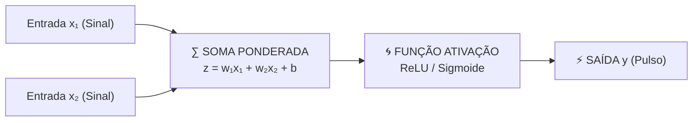

# Aula 15 - Fundamentos de Redes Neurais - Parte 1 (O Neurônio Artificial & Funções de Ativação)

**Disciplina:** Aprendizado de Máquina e Redes Neurais  
**Professor:** Eduardo Lázaro Roesler de Oliveira  
**Instituição:** UNIVEM — Centro Universitário de Marília  

---

> [!NOTE]
> 🔙 **De onde viemos:** Na Aula 14, concluímos todo o ciclo de Machine Learning clássico (Supervisionado e Não Supervisionado) reduzindo dimensões com PCA. Agora, abrimos as portas para o estado da arte da IA moderna: o universo do **Deep Learning**.
> 🎯 **Objetivo Principal da Aula:** Compreender a anatomia matemática de um **Neurônio Artificial (Perceptron de Rosenblatt)**, calcular a soma ponderada com bias ($z = \sum w_i x_i + b$), implementar e comparar as principais **Funções de Ativação (Step, Sigmoide, ReLU, LeakyReLU, Tanh)**, e demonstrar por que um único neurônio falha na porta lógica XOR.
> 🚀 **Para onde vamos:** Na próxima aula ('Fundamentos de Redes Neurais - Parte 2'), superaremos a limitação do neurônio único conectando dezenas de neurônios em camadas ocultas (**Multi-Layer Perceptron / MLP**) e aprenderemos o algoritmo que move o mundo da IA: o **Backpropagation**.

---

## Organização Tática da Aula

| Módulo | Atividade | Foco Pedagógico |
| :--- | :--- | :--- |
| **Módulo 1** | **Fundamentação Teórica & Da Biologia ao Neurônio Artificial** | A metáfora dos neurônios (Dendritos ──► Soma ──► Axônio) e o modelo matemático do Perceptron. |
| **Módulo 2** | **A Matemática Interna do Perceptron & Funções de Ativação** | A equação da Soma Ponderada ($z = \mathbf{w}^T \mathbf{x} + b$) e o papel da não-linearidade (ReLU, Sigmoide). |
| **Módulo 3** | **Prática Guiada no Google Colab** | 7 blocos de código em Python minuciosamente comentados linha por linha com caixas de dúvidas. |
| **Módulo 4** | **Prática Orientada & Experimentação Fácil** | Classificação de flores com Perceptron alterando taxa de aprendizado e épocas. |
| **Módulo 5** | **Checklist de Autonomia & Bibliografia** | Autoavaliação do estudante e referências oficiais. |

---

## Módulo 1: Fundamentação Teórica & A Anatomia do Neurônio Artificial

### 1.1 Do Neurônio Biológico ao Modelo Computacional
Em 1958, Frank Rosenblatt criou o **Perceptron**, o bloco fundamental das Redes Neurais Artificiais:

$$\text{Soma Ponderada } z = \sum_{i=1}^{n} w_i x_i + b$$



### 1.2 Funções de Ativação Não-Lineares
As **Funções de Ativação** inserem capacidade de curvatura, permitindo que a rede aprenda padrões complexos:
- **Degrau (Step):** $f(z) = 1$ se $z \ge 0$, senão $0$.
- **Sigmoide:** $\sigma(z) = \frac{1}{1 + e^{-z}}$ (Probabilidades de $0.0$ a $1.0$).
- **ReLU (Rectified Linear Unit):** $f(z) = \max(0, z)$ (**Padrão mundial em Deep Learning**).

> [!TIP]
> 🦾 **Analogia Geek — O Implante Cyberpunk / Pulso Sináptico:**
> Um neurônio artificial é como um componente cibernético em *Cyberpunk 2077*. Ele recebe sinais de entrada $x$ (sensores), multiplica cada um pela importância do sinal $w$ (pesos), ajusta a sensibilidade $b$ (bias) e dispara um pulso elétrico (saída $y$) somente se a voltagem ultrapassar o limiar ativado pela **ReLU**!

> [!NOTE]
> 💡 **Curiosidade da Aula — O Perceptron Mark I de Frank Rosenblatt (1958):**
> Quando Frank Rosenblatt criou o Perceptron na Marinha dos EUA em 1958, ele não criou apenas um código, ele construiu uma **MÁQUINA FÍSICA GIGANTE!** O *Perceptron Mark I* era um computador de quase meia tonelada com 400 fotocélulas de visão e potenciómetros rotativos mecânicos movidos por motores elétricos para ajustar os pesos $w$ fisicamente! O *New York Times* da época publicou que aquela máquina "em breve pensaria como um ser humano"!  
> 🔗 **Documentação Scikit-Learn:** [scikit-learn Perceptron](https://scikit-learn.org/stable/modules/generated/sklearn.linear_model.Perceptron.html)

> [!IMPORTANT]
> 💡 **Em 1 Frase:** O neurônio artificial calcula a soma ponderada das entradas ($z = \sum w \cdot x + b$) e passa o valor por uma função de ativação para decidir a intensidade do pulso elétrico de saída.

---

## Módulo 2: O Mecanismo por Dentro & Regras Práticas

```
Entradas (x₁, x₂) ──► [ Multiplicação por Pesos (w₁, w₂) + Bias (b) ] ──► [ Ativação f(z) ] ──► Saída ŷ
```

> [!IMPORTANT]
> 💡 **Em 1 Frase:** A função de ativação ReLU ($\max(0, z)$) é a mais usada no mundo porque resolve o problema do desaparecimento do gradiente e é extremamente rápida de calcular.

---

## Módulo 3: Prática Guiada no Google Colab

Abra o [Google Colab](https://colab.research.google.com), crie um novo Notebook e acompanhe os blocos de código abaixo.

> [!NOTE]
> **Roteiro de estudo:** comece pelo neurônio simples: ele recebe números, combina esses valores e produz uma saída. As funções de ativação mudam essa saída. Ao executar os blocos, observe entrada, cálculo e resultado; a matemática detalhada será construída gradualmente, sem necessidade de decorar as fórmulas agora.

---

### Bloco 3.1 — Construindo uma Função de Neurônio Artificial em Python Puro

> [!IMPORTANT]
> 🤔 **Dúvidas Comuns de Iniciantes:**  
> **Como funciona o cálculo interno do neurônio?**  
> O neurônio faz a multiplicação ponto a ponto de cada entrada $x$ por seu peso $w$ (usando o produto escalar `np.dot`) e no final soma a constante $b$ (bias).

```python
# 1. Importamos a biblioteca NumPy para manipulação vetorial
import numpy as np

# 2. Criamos a função Python que calcula a soma ponderada z = (w * x) + b
def calcular_soma_ponderada_neuronio(vetor_entradas, vetor_pesos, valor_bias):
    # Produto escalar entre o vetor de entradas e pesos + o valor de sensibilidade bias
    soma_ponderada_z = np.dot(vetor_entradas, vetor_pesos) + valor_bias
    return soma_ponderada_z

# 3. Definimos valores de teste para entradas, pesos e bias
entradas_exemplo = np.array([2.5, 4.0])
pesos_exemplo = np.array([0.8, -0.5])
bias_exemplo = 1.2

# 4. Calculamos a soma ponderada z
soma_z_calculada = calcular_soma_ponderada_neuronio(entradas_exemplo, pesos_exemplo, bias_exemplo)

# 5. Exibimos a voltagem z calculada no console
print("--- SOMA PONDERADA INTERNA DO NEURÔNIO ---")
print(f"⚡ Valor da Soma Ponderada (z): {soma_z_calculada:.2f}")
```

---

### Bloco 3.2 — Implementando a Função de Ativação Sigmoide em Python

> [!IMPORTANT]
> 🤔 **Dúvidas Comuns de Iniciantes:**  
> **O que a Sigmoide faz com a voltagem $z$?**  
> Ela transforma qualquer número (positivo ou negativo) em um valor suave espremido entre $0.0$ e $1.0$, representando a probabilidade de ativação do neurônio.

```python
# 1. Definimos a função matemática da Sigmoide: 1 / (1 + e^-z)
def aplicar_ativacao_sigmoide(soma_z):
    return 1.0 / (1.0 + np.exp(-soma_z))

# 2. Aplicamos a Sigmoide sobre a soma z calculada anteriormente
saida_probabilidade_sigmoide = aplicar_ativacao_sigmoide(soma_z_calculada)

# 3. Exibimos a probabilidade ativada no console
print("--- ATIVAÇÃO PELA FUNÇÃO SIGMOIDE ---")
print(f"🌐 Saída ativada pela Sigmoide (Probabilidade entre 0 e 1): {saida_probabilidade_sigmoide:.4f}")
```

---

### Bloco 3.3 — Implementando a Função de Ativação ReLU em Python

> [!IMPORTANT]
> 🤔 **Dúvidas Comuns de Iniciantes:**  
> **Como funciona a ReLU ($\max(0, z)$)?**  
> Se a voltagem $z$ for negativa, a ReLU zera o sinal ($0.0$). Se for positiva, a ReLU deixa o número passar intacto ($z$).

```python
# 1. Definimos a função ReLU utilizando np.maximum(0, z)
def aplicar_ativacao_relu(soma_z):
    return np.maximum(0, soma_z)

# 2. Aplicamos a ReLU na voltagem z
saida_ativada_relu = aplicar_ativacao_relu(soma_z_calculada)

# 3. Exibimos a resposta no console
print("--- ATIVAÇÃO PELA FUNÇÃO RELU ---")
print(f"🔥 Saída ativada pela ReLU: {saida_ativada_relu:.2f}")
```

---

### Bloco 3.4 — Instanciando o Perceptron no Scikit-Learn para a Porta AND

> [!IMPORTANT]
> 🤔 **Dúvidas Comuns de Iniciantes:**  
> **O que é a porta lógica AND?**  
> É uma regra lógica onde a saída só é $1$ se TODAS as entradas forem $1$ (`[1, 1] -> 1`). O Perceptron consegue aprender essa separação linear facilmente.

```python
# 1. Importamos a classe Perceptron do Scikit-Learn
from sklearn.linear_model import Perceptron

# 2. Definimos a matriz de entradas X e o vetor de respostas y da porta AND
matriz_entradas_and = np.array([[0, 0], [0, 1], [1, 0], [1, 1]])
vetor_respostas_and = np.array([0, 0, 0, 1])

# 3. Instanciamos e treinamos o neurônio Perceptron na porta AND
modelo_perceptron_and = Perceptron(max_iter=100, eta0=0.1, random_state=42)
modelo_perceptron_and.fit(matriz_entradas_and, vetor_respostas_and)

# 4. Exibimos os pesos w e o bias b aprendidos
print("--- NEURÔNIO PERCEPTRON (PORTA LÓGICA AND) ---")
print(f"⚖️ Pesos Aprendidos (w1, w2): {modelo_perceptron_and.coef_[0]}")
print(f"⚖️ Bias (b) Aprendido:        {modelo_perceptron_and.intercept_[0]}")
print(f"📊 Acurácia nos Dados:        {modelo_perceptron_and.score(matriz_entradas_and, vetor_respostas_and) * 100:.0f}%")
```

---

### Bloco 3.5 — Instanciando o Perceptron para a Porta OR

> [!IMPORTANT]
> 🤔 **Dúvidas Comuns de Iniciantes:**  
> **O que altera na aprendizagem da porta OR?**  
> Na porta OR, a saída é $1$ se PELO MENOS UMA entrada for $1$. O Perceptron ajusta pesos e um bias menor para ativar mais facilmente.

```python
# 1. Definimos a tabela verdade da porta OR
matriz_entradas_or = np.array([[0, 0], [0, 1], [1, 0], [1, 1]])
vetor_respostas_or = np.array([0, 1, 1, 1])

# 2. Instanciamos e treinamos o Perceptron na porta OR
modelo_perceptron_or = Perceptron(max_iter=100, eta0=0.1, random_state=42)
modelo_perceptron_or.fit(matriz_entradas_or, vetor_respostas_or)

# 3. Exibimos os resultados
print("--- NEURÔNIO PERCEPTRON (PORTA LÓGICA OR) ---")
print(f"⚖️ Pesos Aprendidos (w1, w2): {modelo_perceptron_or.coef_[0]}")
print(f"⚖️ Bias (b) Aprendido:        {modelo_perceptron_or.intercept_[0]}")
print(f"📊 Acurácia nos Dados:        {modelo_perceptron_or.score(matriz_entradas_or, vetor_respostas_or) * 100:.0f}%")
```

---

### Bloco 3.6 — Demonstrando a Limitação do Perceptron Único (Porta XOR)

> [!IMPORTANT]
> 🤔 **Dúvidas Comuns de Iniciantes:**  
> **Por que um único Perceptron FALHA na porta XOR?**  
> Porque os pontos da porta XOR não podem ser separados por uma única linha reta! Essa limitação histórica levou à necessidade das **Redes Neurais Multicamadas (MLP)**.

```python
# 1. Definimos a tabela verdade da porta XOR (não-linear)
matriz_entradas_xor = np.array([[0, 0], [0, 1], [1, 0], [1, 1]])
vetor_respostas_xor = np.array([0, 1, 1, 0])

# 2. Tentamos treinar um único neurônio Perceptron na porta XOR
modelo_perceptron_xor = Perceptron(max_iter=100, eta0=0.1, random_state=42)
modelo_perceptron_xor.fit(matriz_entradas_xor, vetor_respostas_xor)

# 3. Exibimos o resultado demonstrando a falha
print("--- TENTATIVA DE CLASSIFICAR PORTA XOR COM 1 NEURÔNIO ---")
print(f"⚠️ Acurácia Obtida: {modelo_perceptron_xor.score(matriz_entradas_xor, vetor_respostas_xor) * 100:.0f}% (FALHOU! Exige Redes Multicamadas!)")
```

---

### Bloco 3.7 — Treinando o Perceptron no Iris Dataset

> [!IMPORTANT]
> 🤔 **Dúvidas Comuns de Iniciantes:**  
> **Como aplicamos o Perceptron em um dataset real?**  
> Passamos as 4 medições das flores para o Perceptron aprender a separar a classe de flor *Setosa* (1) das demais (0).

```python
# 1. Importamos as funções de dados e métricas
from sklearn.datasets import load_iris
from sklearn.model_selection import train_test_split
from sklearn.metrics import accuracy_score

# 2. Carregamos o dataset Iris e isolamos a classe Setosa (target == 0)
dados_iris = load_iris()
matriz_entradas_treino, matriz_entradas_teste, vetor_respostas_treino, vetor_respostas_teste = train_test_split(
    dados_iris.data, 
    (dados_iris.target == 0).astype(int), 
    test_size=0.30, 
    random_state=42
)

# 3. Treinamos o Perceptron no dataset Iris
modelo_perceptron_iris = Perceptron(max_iter=1000, eta0=0.1, random_state=42)
modelo_perceptron_iris.fit(matriz_entradas_treino, vetor_respostas_treino)

# 4. Avaliamos a acurácia nos dados de teste
acuracia_perceptron_iris = accuracy_score(vetor_respostas_teste, modelo_perceptron_iris.predict(matriz_entradas_teste))

# 5. Exibimos a taxa de acerto final
print("--- AVALIAÇÃO DO PERCEPTRON NO DATASET IRIS ---")
print(f"📊 Acurácia do Perceptron no Iris Dataset: {acuracia_perceptron_iris * 100:.2f}%")
```

---

## Módulo 4: Prática Orientada & Experimentação Fácil

### Roteiro de Personalização para o Estudante:
Altere o código do Iris Dataset abaixo para testar novos parâmetros no Perceptron:

1. **Altere a taxa de aprendizado (`eta0`):** Na linha `taxa_aprendizado_escolhida = 0.1`, mude para `0.01` ou `1.0`.
2. **Re-execute e observe:** Veja se os pesos aprendidos mudam com a nova taxa de aprendizado!

```python
# =============================================================================
# CÓDIGO BASE PRONTO PARA SUA EXPERIMENTAÇÃO
# =============================================================================
import numpy as np
from sklearn.datasets import load_iris
from sklearn.model_selection import train_test_split
from sklearn.linear_model import Perceptron
from sklearn.metrics import accuracy_score

# 1. Carregamos e dividimos os dados do Iris Dataset
dados_iris = load_iris()
matriz_treino, matriz_teste, respostas_treino, respostas_teste = train_test_split(
    dados_iris.data, 
    (dados_iris.target == 0).astype(int), 
    test_size=0.30, 
    random_state=42
)

# -----------------------------------------------------------------------------
# STEP 1: PASSO DE EXPERIMENTAÇÃO DO ALUNO — ALTERE A TAXA DE APRENDIZADO (ETA0):
# -----------------------------------------------------------------------------
taxa_aprendizado_escolhida = 0.1 # Tente mudar para 0.01 ou 1.0 e veja o resultado!

# 2. Instanciamos e treinamos o Perceptron com a taxa de aprendizado do estudante
perceptron_estudante = Perceptron(max_iter=1000, eta0=taxa_aprendizado_escolhida, random_state=42)
perceptron_estudante.fit(matriz_treino, respostas_treino)

# 3. Calculamos a acurácia nos dados de teste
acuracia_estudante = accuracy_score(respostas_teste, perceptron_estudante.predict(matriz_teste))

# 4. Exibimos os relatórios da experimentação
print(f"--- RELATÓRIO DO SEU TESTE (Taxa de Aprendizado = {taxa_aprendizado_escolhida}) ---")
print(f"📊 Acurácia nos Dados de Teste: {acuracia_estudante * 100:.2f}%")
print(f"⚖️ Pesos Aprendidos (w1, w2, w3, w4): {perceptron_estudante.coef_[0].round(2)}")
print(f"⚖️ Bias (b) Aprendido:                 {perceptron_estudante.intercept_[0].round(2)}")
```

---

### 🔮 Aquecimento & Spoiler da Próxima Aula (Para Ir Além)

> [!TIP]
> 🧠 **Conceito-Semente — A Dança do Feedforward e Backpropagation**  
> Como uma rede com 500 neurônios aprende? Ela funciona em dois passos contínuos:
> 1. **Para Frente (Feedforward):** O dado entra, passa pelas camadas e a rede arrisca um palpite.
> 2. **Para Trás (Backpropagation):** Medimos o tamanho do erro e voltamos ajustando cada um dos 500 pesos na direção contrária ao erro (*Gradiente Descendente*).  
> Na **Aula 16**, dominaremos esse mecanismo visual e prático!
> 
> 🚀 **Desafio Proativo de Autoestudo (Opcional):**  
> Imagine que você está vendendo um produto por R$ 100 e não vendeu nada (erro grande). No dia seguinte você baixa para R$ 80 e vendeu um pouco. Você ajustou o preço na direção certa! O Backpropagation faz essa mesma calibração em frações de segundo para todos os pesos da rede.

---

## Módulo 5: Checklist de Autonomia do Estudante

- [ ] Compreendi a analogia e a diferença entre um neurônio biológico e artificial.
- [ ] Sei calcular a Soma Ponderada $z = \sum (w_i \cdot x_i) + b$.
- [ ] Entendi a necessidade das Funções de Ativação Não-Lineares (Sigmoide, Tanh, ReLU).
- [ ] Sei instanciar e treinar a classe `Perceptron` no Scikit-Learn.
- [ ] Consigo alterar a taxa de aprendizado `eta0` no script e observar a variação de pesos.

---

## Referências Bibliográficas & Documentações Oficiais

- 📖 **Livro Texto:** Géron, A. — *Mãos à Obra: Aprendizado de Máquina com Scikit-Learn, Keras & TensorFlow* (Capítulo 10).
- 🔗 **Documentação Scikit-Learn:** [scikit-learn Perceptron](https://scikit-learn.org/stable/modules/generated/sklearn.linear_model.Perceptron.html)
