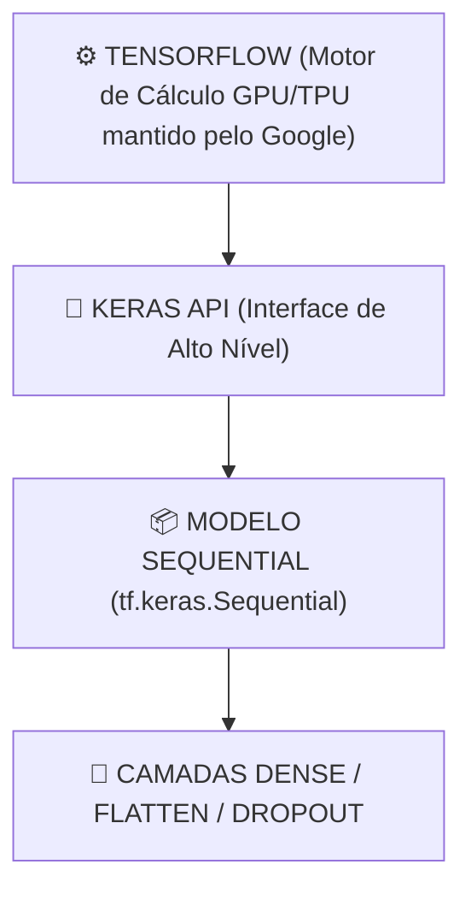

# Aula 17 - Redes Neurais com TensorFlow/Keras - Parte 1 (Arquitetura Sequencial & Keras API)

**Disciplina:** Aprendizado de Máquina e Redes Neurais  
**Professor:** Eduardo Lázaro Roesler de Oliveira  
**Instituição:** UNIVEM — Centro Universitário de Marília  

---

> [!NOTE]
> 🔙 **De onde viemos:** Na Aula 16, compreendemos a mecânica interna de uma rede MLP com camadas ocultas e o ciclo de Feedforward/Backpropagation. Agora, daremos o salto definitivo para o padrão da indústria mundial em Deep Learning.
> 🎯 **Objetivo Principal da Aula:** Dominar a **API Keras do TensorFlow**, construindo arquiteturas profundas através do modelo `Sequential`, empilhando camadas `Flatten` e `Dense`, configurando otimizadores modernos (`adam`), funções de perda (`sparse_categorical_crossentropy`) e treinando uma rede de classificação de imagens de roupas (**Fashion-MNIST**).
> 🚀 **Para onde vamos:** Na próxima aula ('Redes Neurais com TensorFlow/Keras - Parte 2'), aprenderemos a adaptar a nossa arquitetura Keras para resolver qualquer tipo de problema: desde a predição de valores contínuos (**Regressão**) até a classificação probabilística com múltiplas classes (**Softmax & Crossentropy**).

---

## Organização Tática da Aula

| Módulo | Atividade | Foco Pedagógico |
| :--- | :--- | :--- |
| **Módulo 1** | **Fundamentação Teórica & O Ecossistema TensorFlow/Keras** | Por que o TensorFlow é o padrão industrial mantido pelo Google e como a API Keras simplifica o Deep Learning. |
| **Módulo 2** | **Anatomia do Modelo Keras & O Dataset Fashion-MNIST** | `tf.keras.Sequential`, `Dense(units, activation)`, `Flatten(input_shape)`, a normalização de pixels ($0-255 \rightarrow 0-1$). |
| **Módulo 3** | **Prática Guiada no Google Colab** | 8 blocos de código em Python/TensorFlow minuciosamente comentados linha por linha com caixas de dúvidas. |
| **Módulo 4** | **Prática Orientada & Experimentação Fácil** | Classificação de dígitos manuscritos (MNIST) no Keras alterando épocas e neurônios. |
| **Módulo 5** | **Checklist de Autonomia & Bibliografia** | Autoavaliação do estudante e referências oficiais. |

---

## Módulo 1: Fundamentação Teórica & O Ecossistema TensorFlow

### 1.1 O que é o TensorFlow e o Keras?
O **TensorFlow** é a plataforma de código aberto mantida pelo Google para criação e implantação de modelos de Deep Learning em larga escala. O **Keras** é a interface (API) de alto nível incorporada nativamente ao TensorFlow (`tf.keras`).



> [!TIP]
> 👔 **Por que usar o Fashion-MNIST em vez do Iris ou números simples?**
> O dataset *Fashion-MNIST* foi criado pela Zalando (gigante alemã de e-commerce) para substituir o MNIST antigo. Ele contém 70.000 imagens em tons de cinza (28x28 pixels) divididas em **10 categorias reais de produtos de vestuário** (Camisas, Calças, Vestidos, Tênis, Bolsas, Botas). É o teste de fogo perfeito para ver uma rede neural reconhecendo objetos do mundo real!

> [!NOTE]
> 💡 **Curiosidade da Aula — François Chollet e a Criação do Keras (2015):**
> A API Keras foi criada em **2015 por François Chollet**, um engenheiro de software do Google. François criou o Keras como um projeto pessoal nas horas vagas para tornar a criação de redes neurais tão fácil quanto encaixar blocos de LEGO! O sucesso foi tão avassalador que o Google decidiu adotar o Keras como a API padrão oficial de todo o TensorFlow em 2017!  
> 🔗 **Documentação Oficial Keras:** [keras.io](https://keras.io)

> [!IMPORTANT]
> 💡 **Em 1 Frase:** O TensorFlow é o motor de cálculo pesado do Google e o Keras é a interface simples de alto nível que nos permite empilhar camadas de redes neurais como blocos de LEGO.

---

## Módulo 2: O Mecanismo por Dentro & As 3 Etapas do Keras

```
1. ARQUITETURA (Sequential) ──► 2. COMPILAÇÃO (compile) ──► 3. TREINAMENTO (fit)
   Flatten + Dense(ReLU) + Dense(Softmax)  optimizer='adam', loss, metrics=['accuracy']  epochs=10, batch_size=64
```

> [!IMPORTANT]
> 💡 **Em 1 Frase:** Construir modelos no Keras exige três passos claros: definir a arquitetura (`Sequential`), compilar com otimizador e função de perda (`compile`), e treinar pelas épocas desejadas (`fit`).

---

## Módulo 3: Prática Guiada no Google Colab

Abra o [Google Colab](https://colab.research.google.com), crie um novo Notebook e acompanhe os blocos de código abaixo.

> [!NOTE]
> **Roteiro de estudo:** no Keras, montamos a rede em etapas: dados, arquitetura, compilação, treino e avaliação. Leia `Sequential` como uma lista de camadas colocadas em sequência. Primeiro acompanhe o que entra e sai de cada etapa; os nomes de todas as configurações podem ser consultados nos exemplos quando necessário.

---

### Bloco 3.1 — Importando o TensorFlow e Verificando a Versão

> [!IMPORTANT]
> 🤔 **Dúvidas Comuns de Iniciantes:**  
> **Por que importamos o TensorFlow como `tf`?**  
> `tf` é o apelido convencional universal mantido pela comunidade mundial de Ciência de Dados para acessar o ecossistema do TensorFlow.

```python
# 1. Importamos o TensorFlow com a abreviação oficial 'tf'
import tensorflow as tf

# 2. Importamos a biblioteca NumPy para suporte a vetores e Matplotlib para imagens
import numpy as np
import matplotlib.pyplot as plt

# 3. Exibimos a versão oficial instalada no servidor
print("--- CHECAGEM DO AMBIENTE TENSORFLOW ---")
print(f"⚡ Versão do TensorFlow em execução no servidor: {tf.__version__}")
print("🚀 Ecossistema Keras pronto para Deep Learning!")
```

---

### Bloco 3.2 — Carregando o Dataset Fashion-MNIST

> [!IMPORTANT]
> 🤔 **Dúvidas Comuns de Iniciantes:**  
> **Como o Keras carrega os dados das imagens?**  
> Ele já retorna duas tuplas organizadas: `(imagens_treino, respostas_treino)` com 60.000 imagens para a máquina aprender e `(imagens_teste, respostas_teste)` com 10.000 imagens reservadas para avaliação.

```python
# 1. Instanciamos o objeto do dataset Fashion-MNIST a partir da biblioteca de dados do Keras
dataset_fashion_mnist = tf.keras.datasets.fashion_mnist

# 2. Carregamos as imagens e os rótulos de treino e teste
(imagens_treino_brutas, respostas_treino), (imagens_teste_brutas, respostas_teste) = dataset_fashion_mnist.load_data()

# 3. Exibimos o formato estrutural das matrizes no console
print("--- CARREGAMENTO DO FASHION-MNIST ---")
print(f"🖼️ Imagens de Treino: {imagens_treino_brutas.shape} (60.000 imagens de 28x28 pixels)")
print(f"🖼️ Imagens de Teste:  {imagens_teste_brutas.shape} (10.000 imagens de 28x28 pixels)")
```

---

### Bloco 3.3 — Normalização de Pixels de Imagem ($0-255 \rightarrow 0-1$)

> [!IMPORTANT]
> 🤔 **Dúvidas Comuns de Iniciantes:**  
> **Por que dividimos a matriz de pixels por `255.0`?**  
> Em arquivos digitais, a intensidade do brilho de cada pixel varia de 0 (preto) a 255 (branco). Dividir por 255.0 espreme todas as variáveis para a faixa ideal entre **0.0 e 1.0**, permitindo que o Backpropagation funcione sem problemas.

```python
# 1. Dividimos a intensidade de todos os pixels de treino por 255.0
imagens_treino_normalizadas = imagens_treino_brutas / 255.0

# 2. Dividimos a intensidade de todos os pixels de teste por 255.0
imagens_teste_normalizadas = imagens_teste_brutas / 255.0

# 3. Exibimos os limites ajustados de brilho
print("--- NORMALIZAÇÃO DE PIXELS DE IMAGEM ---")
print(f"Intensidade Mínima do Pixel: {imagens_treino_normalizadas.min()}")
print(f"Intensidade Máxima do Pixel: {imagens_treino_normalizadas.max()}")
print("✅ Todos os pixels foram escalados estritamente para o intervalo 0.0 a 1.0!")
```

---

### Bloco 3.4 — Definindo a Lista das 10 Classes de Vestuário

> [!IMPORTANT]
> 🤔 **Dúvidas Comuns de Iniciantes:**  
> **Como o Keras identifica as categorias?**  
> Os rótulos do dataset são números inteiros de 0 a 9. Criamos uma lista de texto em português onde a posição `0` corresponde a 'Camiseta/Top', a posição `1` a 'Calça', e assim por diante.

```python
# 1. Criamos a lista em português associando cada índice de 0 a 9 ao nome do produto
lista_classes_vestuario = [
    'Camiseta/Top', 'Calça', 'Pullover', 'Vestido', 'Casaco',
    'Sandália', 'Camisa', 'Tênis', 'Bolsa', 'Bota'
]

# 2. Exibimos o dicionário de classes no console
print("--- CLASSES DE VESTUÁRIO QUE A IA IRÁ APRENDER ---")
for indice, nome_peca in enumerate(lista_classes_vestuario):
    print(f"   Classe {indice}: {nome_peca}")
```

---

### Bloco 3.5 — Montando a Arquitetura da Rede Neural Keras (`tf.keras.Sequential`)

> [!IMPORTANT]
> 🤔 **Dúvidas Comuns de Iniciantes:**  
> **O que fazem as camadas `Flatten`, `Dense(128)` e `Dense(10)`?**  
> - `Flatten`: "achata" a imagem 2D ($28 \times 28$) em um vetor reto de 784 entradas.  
> - `Dense(128, activation='relu')`: camada oculta com 128 neurônios para aprender características visuais.  
> - `Dense(10, activation='softmax')`: camada de saída com 10 neurônios que calcula a probabilidade da imagem pertencer a cada uma das 10 roupas.

```python
# 1. Criamos o modelo Sequencial empilhando as camadas da rede neural
modelo_sequencial_keras = tf.keras.Sequential([
    # Achatamos a matriz de imagem 2D (28x28) em um vetor retilíneo de 784 números de entrada
    tf.keras.layers.Flatten(input_shape=(28, 28)),
    
    # Camada oculta densa contendo 128 neurônios artificiais com ativação ReLU
    tf.keras.layers.Dense(128, activation='relu'),
    
    # Camada de saída com 10 neurônios (um para cada classe de roupa) com ativação Softmax
    tf.keras.layers.Dense(10, activation='softmax')
])

# 2. Exibimos o resumo completo da arquitetura e total de parâmetros treináveis
print("--- ESTRUTURA DA REDE NEURAL PROFUNDA KERAS ---")
modelo_sequencial_keras.summary()
```

---

### Bloco 3.6 — Compilação do Modelo (`compile`)

> [!IMPORTANT]
> 🤔 **Dúvidas Comuns de Iniciantes:**  
> **O que é o otimizador `adam` e a perda `sparse_categorical_crossentropy`?**  
> - `adam`: é o algoritmo de gradiente descendente com momento adaptativo mais rápido e eficiente do Deep Learning.  
> - `sparse_categorical_crossentropy`: é a função de perda padrão para classificação multiclasse quando nossos rótulos são números inteiros ($0, 1, 2, \dots, 9$).

```python
# 1. Compilamos o modelo definindo o otimizador, a função de perda e a métrica de acurácia
modelo_sequencial_keras.compile(
    optimizer='adam',
    loss='sparse_categorical_crossentropy',
    metrics=['accuracy']
)

# 2. Exibimos mensagem de confirmação
print("--- COMPILAÇÃO DO MODELO KERAS ---")
print("✅ Modelo compilado com Otimizador ADAM e Loss Sparse Categorical Crossentropy!")
```

---

### Bloco 3.7 — Treinamento da Rede Neural Keras (`fit`)

> [!IMPORTANT]
> 🤔 **Dúvidas Comuns de Iniciantes:**  
> **O que significa `batch_size=64`?**  
> Significa que a rede neural processará o erro e atualizará os pesos a cada bloco de 64 imagens lidas, aumentando a velocidade de cálculo.

```python
# 1. Treinamos a rede neural informando as imagens, rótulos, épocas e o tamanho do batch
historico_treinamento_keras = modelo_sequencial_keras.fit(
    imagens_treino_normalizadas, 
    respostas_treino, 
    epochs=10, 
    batch_size=64, 
    validation_split=0.2
)
```

---

### Bloco 3.8 — Avaliação Quantitativa nos Dados de Teste (`evaluate`)

> [!IMPORTANT]
> 🤔 **Dúvidas Comuns de Iniciantes:**  
> **O que faz o método `.evaluate()`?**  
> Ele roda as 10.000 imagens reservadas de teste no modelo treinado e retorna o valor exato da perda e a taxa de acurácia obtida em dados não vistos.

```python
# 1. Submetemos as imagens de teste reservadas ao método evaluate do Keras
perda_teste, acuracia_teste_final = modelo_sequencial_keras.evaluate(imagens_teste_normalizadas, respostas_teste, verbose=0)

# 2. Exibimos os relatórios de acurácia e perda no console
print("--- AVALIAÇÃO FINAL NO CONJUNTO DE TESTE ---")
print(f"📊 Valor da Perda (Loss) no Teste:    {perda_teste:.4f}")
print(f"🎉 Acurácia Final da Rede Neural nos Dados de Teste: {acuracia_teste_final * 100:.2f}%")
```

---

## Módulo 4: Prática Orientada & Experimentação Fácil

### Roteiro de Personalização para o Estudante:
Altere a arquitetura Keras do dataset de números manuscritos (MNIST) abaixo para personalizar o seu treinamento:

1. **Altere a quantidade de neurônios:** Na linha `quantidade_neuronios_escolhida = 128`, mude para `64` ou `256`.
2. **Altere a quantidade de épocas:** Na linha `quantidade_epocas_escolhida = 5`, mude para `8` ou `10`.
3. **Re-execute e observe:** Veja como a acurácia no teste final melhora com a sua nova arquitetura!

```python
# =============================================================================
# CÓDIGO BASE PRONTO PARA SUA EXPERIMENTAÇÃO
# =============================================================================
import tensorflow as tf

# 1. Carregamos o dataset MNIST de dígitos manuscritos
mnist = tf.keras.datasets.mnist
(imagens_treino, respostas_treino), (imagens_teste, respostas_teste) = mnist.load_data()
imagens_treino, imagens_teste = imagens_treino / 255.0, imagens_teste / 255.0

# -----------------------------------------------------------------------------
# STEP 1: PASSO DE EXPERIMENTAÇÃO DO ALUNO — PERSONALIZE NEURÔNIOS E ÉPOCAS:
# -----------------------------------------------------------------------------
quantidade_neuronios_escolhida = 128 # Tente mudar para 64 ou 256
quantidade_epocas_escolhida = 5      # Tente mudar para 8 ou 10 épocas

# 2. Montamos o modelo sequencial do estudante
modelo_estudante = tf.keras.Sequential([
    tf.keras.layers.Flatten(input_shape=(28, 28)),
    tf.keras.layers.Dense(quantidade_neuronios_escolhida, activation='relu'),
    tf.keras.layers.Dense(10, activation='softmax')
])

# 3. Compilamos e treinamos o modelo personalizado
modelo_estudante.compile(optimizer='adam', loss='sparse_categorical_crossentropy', metrics=['accuracy'])
modelo_estudante.fit(imagens_treino, respostas_treino, epochs=quantidade_epocas_escolhida, batch_size=64)

# 4. Avaliamos nos dados de teste de dígitos manuscritos
perda_teste, acuracia_estudante_teste = modelo_estudante.evaluate(imagens_teste, respostas_teste, verbose=0)

# 5. Exibimos os relatórios numéricos
print(f"--- RELATÓRIO DO SEU TESTE ({quantidade_neuronios_escolhida} Neurônios, {quantidade_epocas_escolhida} Épocas) ---")
print(f"🎉 Acurácia obtida no Reconhecimento de Números: {acuracia_estudante_teste * 100:.2f}%")
```

---

### 🔮 Aquecimento & Spoiler da Próxima Aula (Para Ir Além)

> [!TIP]
> 🧠 **Conceito-Semente — A Regra de Ouro da Camada de Saída no Keras**  
> Como a rede neural sabe se deve prever um número em reais ou escolher uma entre 5 categorias? A mágica acontece na **última camada** e na **função de perda (`loss`)**:
> - Para prever valores contínuos (Regressão): 1 neurônio sem ativação final e `loss='mse'`.
> - Para escolher entre categorias: $N$ neurônios com ativação `'softmax'` e `loss='sparse_categorical_crossentropy'`.  
> Na **Aula 18**, dominaremos essa regra e compararemos os dois formatos!
> 
> 🚀 **Desafio Proativo de Autoestudo (Opcional):**  
> Por que uma função Softmax é chamada de 'probabilística'? (Dica: o que acontece se você somar todas as probabilidades de saída de uma camada Softmax? A soma sempre dá exatamente $1.0$ / $100\%$).

---

## Módulo 5: Checklist de Autonomia do Estudante

- [ ] Compreendi o que é o TensorFlow e a facilidade da API Keras (`tf.keras`).
- [ ] Sei normalizar imagens dividindo pixels por 255.0.
- [ ] Sei criar redes neurais usando `tf.keras.Sequential`, `Flatten` e `Dense`.
- [ ] Entendi como compilar modelos definindo o otimizador `adam` e a função de perda.
- [ ] Consigo alterar o número de neurônios no script e observar a variação de acurácia.

---

## Referências Bibliográficas & Documentações Oficiais

- 📖 **Livro Texto:** Géron, A. — *Mãos à Obra: Aprendizado de Máquina com Scikit-Learn, Keras & TensorFlow* (Capítulo 10).
- 🔗 **Documentação Oficial Keras:** [keras.io](https://keras.io)
