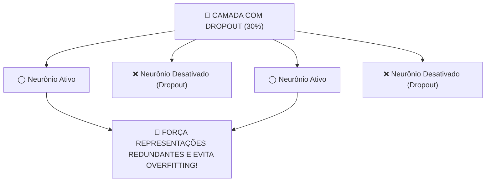

# Aula 19 - Redes Neurais com TensorFlow/Keras - Parte 3 (Regularização, Callbacks & Persistência)

**Disciplina:** Aprendizado de Máquina e Redes Neurais  
**Professor:** Eduardo Lázaro Roesler de Oliveira  
**Instituição:** UNIVEM — Centro Universitário de Marília  

---

> [!NOTE]
> 🔙 **De onde viemos:** Na Aula 18, aprendemos a estruturar redes neurais Keras tanto para problemas de Regressão quanto para Classificação Multiclasse. Mas redes profundas são propensas ao sobreajuste (*Overfitting*), decorando o conjunto de treino e falhando em dados novos.
> 🎯 **Objetivo Principal da Aula:** Aplicar técnicas profissionais de regularização e persistência em Deep Learning: inserir camadas de **Dropout** para quebrar co-adaptações de neurônios, configurar **Keras Callbacks (`EarlyStopping` e `ModelCheckpoint`)** para automação de treinamento, e salvar/recarregar modelos `.keras` do disco para ambientes de produção.
> 🚀 **Para onde vamos:** Na próxima aula ('Aula 20 - Projeto Integrador'), chegaremos ao grande momento de coroação da disciplina: construiremos um **Pipeline Completo End-to-End**, unindo tudo o que aprendemos desde a Aula 01 até a 19 para resolver um desafio do mundo real comparando Machine Learning clássico contra Deep Learning!

---

## Organização Tática da Aula

| Módulo | Atividade | Foco Pedagógico |
| :--- | :--- | :--- |
| **Módulo 1** | **Fundamentação Teórica & Combate ao Overfitting em Deep Learning** | O conceito de desativação aleatória de neurônios (**Dropout**) e parada precoce baseada na validação. |
| **Módulo 2** | **Keras Callbacks & Persistência de Modelos** | `EarlyStopping(patience=5)`, `ModelCheckpoint(save_best_only=True)` e salvamento em arquivo `.keras`. |
| **Módulo 3** | **Prática Guiada no Google Colab** | 8 blocos de código em Python/TensorFlow minuciosamente comentados linha por linha com caixas de dúvidas. |
| **Módulo 4** | **Prática Orientada & Experimentação Fácil** | Teste do callback EarlyStopping e Dropout com alteração da taxa `rate` no Fashion-MNIST. |
| **Módulo 5** | **Checklist de Autonomia & Bibliografia** | Autoavaliação do estudante e referências oficiais. |

---

## Módulo 1: Fundamentação Teórica & Regularização em Deep Learning

### 1.1 O que é o Dropout?
A técnica de **Dropout** "desliga" aleatoriamente uma porcentagem dos neurônios de uma camada (ex: $20\%$ a $50\%$) a cada passo de treinamento (*batch*), forçando a rede a aprender representações redundantes e imunes ao overfitting.



> [!TIP]
> 💾 **Analogia Geek — O Save Point / Checkpoint antes do Chefão:**
> O **EarlyStopping** é como o sensor inteligente do jogo que percebe que você parou de evoluir e começou a perder vida. O **ModelCheckpoint** cria um *Save Point* automático no melhor segundo da sua partida (`.keras`), garantindo que você nunca perca o melhor progresso alcançado!

> [!NOTE]
> 💡 **Curiosidade da Aula — Geoffrey Hinton e a História do Banco (Como surgiu o Dropout):**
> Geoffrey Hinton contou que teve a ideia do **Dropout** ao observar o funcionamento dos guichês de bancos em sua cidade. Ele notou que os funcionários trocavam de guichê aleatoriamente ao longo do dia. Quando perguntou o motivo, explicaram que isso evitava que funcionários conluiassem com clientes para aplicar fraudes! Hinton pensou: *"Se eu desativar neurônios aleatoriamente a cada batch, impeço que neurônios formem conluios (overfitting) memorizando os dados de treino!"*  
> 🔗 **Documentação Keras Callbacks:** [keras.io/api/callbacks](https://keras.io/api/callbacks/)

> [!IMPORTANT]
> 💡 **Em 1 Frase:** O Dropout desativa neurônios de forma sorteada a cada época para impedir que a rede decore os dados de treino, garantindo alta capacidade de generalização.

---

## Módulo 2: O Mecanismo por Dentro & Keras Callbacks

### 2.1 O que são Keras Callbacks?
1. **`EarlyStopping`:** Monitora a perda de validação (`val_loss`) e interrompe o treinamento se a perda parar de cair por $N$ épocas (`patience=5`).
2. **`ModelCheckpoint`:** Salva em arquivo no disco (`melhor_modelo.keras`) a melhor versão da rede neural.
3. **Persistência (`load_model`):** Permite recarregar o arquivo salvo no disco para fazer inferências sem re-treinar.

> [!IMPORTANT]
> 💡 **Em 1 Frase:** Callbacks são gatilhos inteligentes que monitoram o treino, interrompendo épocas desnecessárias com `EarlyStopping` e salvando o modelo campeão no disco com `ModelCheckpoint`.

---

## Módulo 3: Prática Guiada no Google Colab

Abra o [Google Colab](https://colab.research.google.com), crie um novo Notebook e acompanhe os blocos de código abaixo.

> [!NOTE]
> **Roteiro de estudo:** primeiro observe os sinais de overfitting; depois veja como cada recurso responde a esse problema. Dropout reduz uma parte das conexões durante o treino, e callbacks acompanham o processo para parar ou salvar o modelo no momento adequado. Execute os blocos em ordem, pois o modelo salvo depende do treinamento anterior.

---

### Bloco 3.1 — Importando TensorFlow e os Módulos de Callbacks

> [!IMPORTANT]
> 🤔 **Dúvidas Comuns de Iniciantes:**  
> **Quais módulos importamos para persistência e callbacks?**  
> `EarlyStopping` e `ModelCheckpoint` de `tensorflow.keras.callbacks` para controle do treino, e `load_model` de `tensorflow.keras.models` para abrir o arquivo salvo.

```python
# 1. Importamos o TensorFlow e bibliotecas de apoio
import tensorflow as tf
import numpy as np
import matplotlib.pyplot as plt

# 2. Importamos os callbacks de parada precoce e salvamento do Keras
from tensorflow.keras.callbacks import EarlyStopping, ModelCheckpoint

# 3. Importamos a função para carregar modelos persistidos no disco
from tensorflow.keras.models import load_model

# 4. Exibimos mensagem de confirmação
print("--- CHECAGEM DE MÓDULOS DE DROPOUT E CALLBACKS ---")
print("✅ Módulos do Keras para regularização e persistência carregados!")
```

---

### Bloco 3.2 — Carregando e Normalizando o Dataset Fashion-MNIST

> [!IMPORTANT]
> 🤔 **Dúvidas Comuns de Iniciantes:**  
> **Como garantimos que os pixels estão normalizados?**  
> Dividimos todas as matrizes por `255.0`, escalando a intensidade das imagens rigorosamente no intervalo de 0.0 a 1.0.

```python
# 1. Carregamos o dataset Fashion-MNIST no Keras
fashion_mnist = tf.keras.datasets.fashion_mnist
(imagens_treino_brutas, respostas_treino), (imagens_teste_brutas, respostas_teste) = fashion_mnist.load_data()

# 2. Normalizamos os pixels das imagens dividindo por 255.0
imagens_treino_normalizadas = imagens_treino_brutas / 255.0
imagens_teste_normalizadas = imagens_teste_brutas / 255.0

# 3. Exibimos a forma estrutural das imagens normalizadas
print("--- FASHION-MNIST CARREGADO E NORMALIZADO ---")
print(f"🖼️ Base de Treino Normalizada: {imagens_treino_normalizadas.shape}")
```

---

### Bloco 3.3 — Construindo a Rede Neural Keras com Camadas Dropout (`tf.keras.layers.Dropout`)

> [!IMPORTANT]
> 🤔 **Dúvidas Comuns de Iniciantes:**  
> **O que o número `0.3` no `Dropout(0.3)` faz?**  
> Ele instrui o Keras a desligar aleatoriamente 30% dos neurônios dessa camada a cada passo de treinamento (batch), evitando que a rede decore os dados.

```python
# 1. Montamos a estrutura sequencial incluindo camadas de Dropout entre as densas
modelo_com_dropout = tf.keras.Sequential([
    # Achatamos a imagem 2D (28x28) para 784 entradas
    tf.keras.layers.Flatten(input_shape=(28, 28)),
    
    # 1ª Camada Oculta com 256 neurônios e ativação ReLU
    tf.keras.layers.Dense(256, activation='relu'),
    tf.keras.layers.Dropout(0.3), # Desativa aleatoriamente 30% dos neurônios a cada batch
    
    # 2ª Camada Oculta com 128 neurônios e ativação ReLU
    tf.keras.layers.Dense(128, activation='relu'),
    tf.keras.layers.Dropout(0.2), # Desativa aleatoriamente 20% dos neurônios a cada batch
    
    # Camada de saída com 10 neurônios e ativação Softmax para as 10 roupas
    tf.keras.layers.Dense(10, activation='softmax')
])

# 2. Exibimos o resumo da arquitetura regularizada no console
print("--- ARQUITETURA KERAS COM CAMADAS DROPOUT ---")
modelo_com_dropout.summary()
```

---

### Bloco 3.4 — Configurando os Keras Callbacks (`EarlyStopping` e `ModelCheckpoint`)

> [!IMPORTANT]
> 🤔 **Dúvidas Comuns de Iniciantes:**  
> **O que significa `patience=5` e `save_best_only=True`?**  
> - `patience=5`: se a perda no conjunto de validação parou de cair por 5 épocas consecutivas, o treinamento para.  
> - `save_best_only=True`: salva no arquivo `.keras` **apenas** quando o modelo atinge o seu recorde absoluto de menor erro na validação!

```python
# 1. Criamos a lista contendo as duas instâncias de Callbacks
callbacks_lista_keras = [
    # Interrompe o treino se a perda val_loss não melhorar por 5 épocas seguidas e restaura o melhor peso
    EarlyStopping(monitor='val_loss', patience=5, restore_best_weights=True, verbose=1),
    
    # Salva o arquivo no disco contendo a melhor versão dos pesos aprendidos
    ModelCheckpoint('melhor_modelo_moda.keras', monitor='val_loss', save_best_only=True, verbose=1)
]

# 2. Exibimos a confirmação no console
print("--- LISTA DE CALLBACKS KERAS CONFIGURADA ---")
print("✅ EarlyStopping (patience=5) e ModelCheckpoint salvando em 'melhor_modelo_moda.keras'!")
```

---

### Bloco 3.5 — Compilando o Modelo Keras

> [!IMPORTANT]
> 🤔 **Dúvidas Comuns de Iniciantes:**  
> **Por que compilamos antes de chamar o `.fit()`?**  
> Porque a compilação prepara o grafo de execução do Keras vinculando o otimizador ADAM e a função de perda à arquitetura com Dropout.

```python
# 1. Compilamos a rede informando o otimizador, a função de perda e a métrica de acurácia
modelo_com_dropout.compile(
    optimizer='adam', 
    loss='sparse_categorical_crossentropy', 
    metrics=['accuracy']
)

# 2. Exibimos confirmação
print("✅ Modelo Keras compilado e pronto para treinamento com Callbacks!")
```

---

### Bloco 3.6 — Treinando com Callbacks e Validação Automática (`fit`)

> [!IMPORTANT]
> 🤔 **Dúvidas Comuns de Iniciantes:**  
> **Como o Keras monitora o `val_loss` durante o treino?**  
> O parâmetro `validation_split=0.2` separa 20% das imagens de treino exclusivamente para validação a cada época. O `EarlyStopping` analisa essa perda de validação.

```python
# 1. O MOMENTO DO TREINAMENTO REGULARIZADO: O fit recebe a lista de callbacks no parâmetro callbacks
historico_treinamento = modelo_com_dropout.fit(
    imagens_treino_normalizadas, 
    respostas_treino, 
    epochs=30, 
    batch_size=64, 
    validation_split=0.2, 
    callbacks=callbacks_lista_keras
)
```

---

### Bloco 3.7 — Recarregando o Modelo Salvo do Disco (`load_model`)

> [!IMPORTANT]
> 🤔 **Dúvidas Comuns of Iniciantes:**  
> **Para que serve o método `load_model()`?**  
> Ele permite abrir o arquivo `.keras` gravado no disco em um novo notebook ou sistema em produção, executando previsões instantaneamente sem ter que treinar a rede do zero!

```python
# 1. Recarregamos o arquivo do modelo salvo no disco usando load_model
modelo_recarregado_disco = load_model('melhor_modelo_moda.keras')

# 2. Exibimos mensagem de confirmação
print("🎉 MODELO RECUPERADO COM SUCESSO DO DISCO (.keras)!")
print("💾 O arquivo de pesos foi carregado e está pronto para fazer inferências sem re-treinar!")
```

---

### Bloco 3.8 — Avaliação do Modelo Recarregado nos Dados de Teste

> [!IMPORTANT]
> 🤔 **Dúvidas Comuns de Iniciantes:**  
> **Como testar o modelo recarregado?**  
> Executamos `.evaluate()` diretamente na variável `modelo_recarregado_disco` usando as 10.000 imagens de teste.

```python
# 1. Submetemos o modelo recarregado do disco à avaliação no conjunto de teste
perda_teste, acuracia_teste_salvo = modelo_recarregado_disco.evaluate(imagens_teste_normalizadas, respostas_teste, verbose=0)

# 2. Exibimos os relatórios numéricos no console
print("--- AVALIAÇÃO DO MODELO PERSISTIDO EM DISCO ---")
print(f"📊 ACURÁCIA DO MODELO SALVO NOS DADOS DE TESTE: {acuracia_teste_salvo * 100:.2f}%")
```

---

## Módulo 4: Prática Orientada & Experimentação Fácil

### Roteiro de Personalização para o Estudante:
Altere o script de treinamento com dígitos do MNIST abaixo para testar diferentes taxas de Dropout e paciência do EarlyStopping:

1. **Altere o valor do Dropout:** Na linha `taxa_dropout_escolhida = 0.25`, mude para `0.10` ou `0.40`.
2. **Altere a paciência:** Na linha `paciencia_early_stopping = 3`, mude para `5`.
3. **Re-execute e observe:** Veja em qual época o modelo interrompeu o treinamento!

```python
# =============================================================================
# CÓDIGO BASE PRONTO PARA SUA EXPERIMENTAÇÃO
# =============================================================================
import tensorflow as tf

# 1. Carregamos e normalizamos o dataset MNIST de números manuscritos
mnist = tf.keras.datasets.mnist
(imagens_treino, respostas_treino), (imagens_teste, respostas_teste) = mnist.load_data()
imagens_treino, imagens_teste = imagens_treino / 255.0, imagens_teste / 255.0

# -----------------------------------------------------------------------------
# STEP 1: PASSO DE EXPERIMENTAÇÃO DO ALUNO — ALTERE DROPOUT E PACIÊNCIA:
# -----------------------------------------------------------------------------
taxa_dropout_escolhida = 0.25      # Tente mudar para 0.10 ou 0.40
paciencia_early_stopping = 3       # Tente mudar para 5 épocas

# 2. Montamos a rede neural com o Dropout do estudante
modelo_estudante_regularizado = tf.keras.Sequential([
    tf.keras.layers.Flatten(input_shape=(28, 28)),
    tf.keras.layers.Dense(128, activation='relu'),
    tf.keras.layers.Dropout(taxa_dropout_escolhida),
    tf.keras.layers.Dense(10, activation='softmax')
])

# 3. Compilamos o modelo
modelo_estudante_regularizado.compile(optimizer='adam', loss='sparse_categorical_crossentropy', metrics=['accuracy'])

# 4. Criamos os callbacks do estudante
callbacks_estudante = [
    tf.keras.callbacks.EarlyStopping(monitor='val_loss', patience=paciencia_early_stopping, restore_best_weights=True),
    tf.keras.callbacks.ModelCheckpoint('modelo_digits_custom.keras', save_best_only=True, verbose=0)
]

# 5. Treinamos com os callbacks e recarregamos do disco
modelo_estudante_regularizado.fit(imagens_treino, respostas_treino, epochs=20, batch_size=64, validation_split=0.2, callbacks=callbacks_estudante)

modelo_salvo_disco = tf.keras.models.load_model('modelo_digits_custom.keras')
perda_f, acuracia_modelo_salvo = modelo_salvo_disco.evaluate(imagens_teste, respostas_teste, verbose=0)

# 6. Exibimos os resultados
print(f"--- RELATÓRIO DO SEU TESTE (Dropout={taxa_dropout_escolhida}, Patience={paciencia_early_stopping}) ---")
print(f"🎉 Acurácia obtida no modelo salvo do disco: {acuracia_modelo_salvo * 100:.2f}%")
```

---

### 🔮 Aquecimento & Spoiler da Próxima Aula (Para Ir Além)

> [!TIP]
> 🧠 **Conceito-Semente — O Grande Duelo: Machine Learning Clássico vs. Deep Learning**  
> Chegamos ao ápice da nossa jornada! Na **Aula 20 (Projeto Integrador)**, colocaremos a **Random Forest** (o rei do ML clássico tabular) para disputar contra uma **Rede Neural Profunda Keras** no mesmo dataset real (Titanic). Percorreremos todas as 6 etapas do ciclo de dados e você criará sua própria função de inferência para testar novos passageiros!
> 
> 🚀 **Desafio Proativo de Autoestudo (Opcional):**  
> Revise seu checklist pessoal: qual foi o seu algoritmo favorito ao longo do semestre? Prepare suas anotações para o grande desafio da próxima aula!

---

## Módulo 5: Checklist de Autonomia do Estudante

- [ ] Compreendi o que é o *Dropout* e como ele desativa neurônios para conter o Overfitting.
- [ ] Sei configurar o callback `EarlyStopping` para interromper o treino automaticamente.
- [ ] Sei utilizar o `ModelCheckpoint` para salvar a melhor versão do modelo no disco (`.keras`).
- [ ] Consigo carregar um modelo salvo no disco usando `tf.keras.models.load_model()`.
- [ ] Sei alterar a taxa de Dropout e a paciência do EarlyStopping no script.

---

## Referências Bibliográficas & Documentações Oficiais

- 📖 **Livro Texto:** Géron, A. — *Mãos à Obra: Aprendizado de Máquina com Scikit-Learn, Keras & TensorFlow* (Capítulo 11).
- 🔗 **Documentação Keras Callbacks:** [keras.io/api/callbacks](https://keras.io/api/callbacks/)
