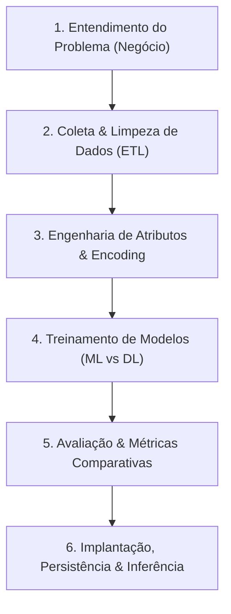

# Aula 20 - Projeto Integrador: Pipeline Completo de Machine Learning & Deep Learning

**Disciplina:** Aprendizado de Máquina e Redes Neurais  
**Professor:** Eduardo Lázaro Roesler de Oliveira  
**Instituição:** UNIVEM — Centro Universitário de Marília  

---

> [!NOTE]
> 🔙 **De onde viemos:** Ao longo das últimas 19 aulas, construímos uma fundação sólida e progressiva: dominamos NumPy, Pandas, Limpeza e Engenharia de Atributos, Visualização, Modelos Supervisionados (Regressão, Logística, Árvores, Random Forest, SVM), Validação e Otimização, Agrupamentos (K-Means, DBSCAN, PCA) e Redes Neurais Profundas no TensorFlow/Keras.
> 🎯 **Objetivo Principal da Aula:** Consolidar todo o conhecimento da disciplina executando um **Projeto Integrador End-to-End** no dataset Titanic, percorrendo o ciclo de vida completo de uma solução de IA: Análise Exploratória $\rightarrow$ Limpeza $\rightarrow$ Encoding $\rightarrow$ Treinamento Comparativo (Random Forest vs Rede Neural Keras) $\rightarrow$ Avaliação de Métricas $\rightarrow$ Função de Inferência em Produção.
> 🚀 **Para onde vamos:** Parabéns! Você concluiu a disciplina de **Aprendizado de Máquina e Redes Neurais**. Você agora domina o vocabulário, as boas práticas e o ferramental prático para construir e avaliar modelos de Inteligência Artificial em problemas do mundo real!

---

## Organização Tática da Aula

| Módulo | Atividade | Foco Pedagógico |
| :--- | :--- | :--- |
| **Módulo 1** | **Revisão do Ciclo End-to-End & Problema de Negócio** | Entendimento do problema do Titanic, formulação de hipóteses e inspeção de dados brutos. |
| **Módulo 2** | **Pipeline de ETL & Pre-processamento Avançado** | Tratamento de `NaN`, Engenharia de Atributos, One-Hot Encoding e Scaling. |
| **Módulo 3** | **Prática Guiada no Google Colab** | 9 blocos de código em Python minuciosamente comentados linha por linha com caixas de dúvidas. |
| **Módulo 4** | **Prática Orientada & Experimentação Fácil** | Teste comparativo entre Random Forest e Rede Neural Keras alterando hiperparâmetros. |
| **Módulo 5** | **Checklist de Autonomia & Bibliografia** | Autoavaliação do estudante e referências oficiais. |

---

## Módulo 1: O Ciclo de Vida Completo de um Projeto de IA

Neste projeto integrador, percorremos rigorosamente as **6 Etapas de um Projeto de Ciência de Dados**:



> [!NOTE]
> 🚢 **Por que o Titanic Dataset no Projeto Integrador Final?**
> O conjunto de dados do Titanic é o desafio integrador mais famoso do mundo hospedado no [Kaggle](https://www.kaggle.com/c/titanic). Ele reúne todos os desafios reais da profissão: dados incompletos (`Age` nula), variáveis categóricas (`Sex`, `Embarked`), necessidades de Engenharia de Atributos (`tamanho_familia`) e a comparação prática entre um algoritmo clássico (Random Forest) e um modelo de Deep Learning (Rede Neural Keras)!

> [!NOTE]
> 💡 **Curiosidade da Aula — A Competição Lendária do Kaggle:**
> Mais de **50.000 cientistas de dados do mundo inteiro** começaram suas carreiras submetendo palpites no desafio do Titanic do Kaggle! O dataset retrata o trágico naufrágio do RMS Titanic em 1912. Ele provou empiricamente a regra histórica *"Mulheres e crianças primeiro"*, pois passageiros do sexo feminino e de 1ª classe tiveram taxas de sobrevivência dramaticamente maiores do que homens adultos da 3ª classe!

> [!IMPORTANT]
> 💡 **Em 1 Frase:** Um projeto de Inteligência Artificial completo engloba desde o entendimento do negócio, limpeza de dados (ETL) e engenharia de atributos até a comparação rigorosa de modelos de Machine Learning e Deep Learning.

---

## Módulo 2: O Mecanismo por Dentro & Preparação dos Dados

### 2.1 As Etapas do Tratamento Integrado
1. **Imputação de Nulos:** Preenchimento da coluna `age` com a mediana e `embarked` com a moda.
2. **Engenharia de Atributos (*Feature Engineering*):** Criação da nova coluna `tamanho_familia`.
3. **Encoding Categórico:** Conversão de gênero e porto de embarque via `pd.get_dummies`.
4. **Padronização:** Aplicação do `StandardScaler` em todas as colunas para abastecer os modelos.

> [!IMPORTANT]
> 💡 **Em 1 Frase:** A Engenharia de Atributos cria novos dados com base em conhecimentos de negócio, enquanto o escalonamento padronizado garante estabilidade nos algoritmos.

---

## Módulo 3: Prática Guiada no Google Colab

Abra o [Google Colab](https://colab.research.google.com), crie um novo Notebook e acompanhe os blocos de código abaixo.

> [!NOTE]
> **Roteiro de estudo:** este projeto junta etapas já praticadas nas aulas anteriores. Não tente entender tudo de uma vez: siga o ciclo dados brutos, limpeza, transformação, divisão, treinamento e avaliação. Em cada bloco, identifique qual dessas etapas está sendo executada e consulte a aula correspondente quando precisar retomar um conceito.

---

### Bloco 3.1 — Importação de Bibliotecas do Pipeline Completo

> [!IMPORTANT]
> 🤔 **Dúvidas Comuns de Iniciantes:**  
> **Quais bibliotecas estamos unindo neste projeto final?**  
> Unimos Pandas (tabelas), Seaborn (dados e gráficos), Scikit-Learn (divisão, escala, Random Forest e métricas) e TensorFlow/Keras (Redes Neurais de Deep Learning).

```python
# 1. Importamos o ecossistema completo de dados, estatística e Inteligência Artificial
import numpy as np
import pandas as pd
import seaborn as sns
import matplotlib.pyplot as plt
import tensorflow as tf

# 2. Importamos os utilitários e o algoritmo clássico do Scikit-Learn
from sklearn.model_selection import train_test_split
from sklearn.preprocessing import StandardScaler
from sklearn.ensemble import RandomForestClassifier
from sklearn.metrics import accuracy_score, classification_report, confusion_matrix

# 3. Exibimos mensagem de início do projeto integrador
print("--- PIPELINE INTEGRADOR DE MACHINE LEARNING E DEEP LEARNING ---")
print("✅ Todas as bibliotecas do ecossistema carregadas com sucesso!")
```

---

### Bloco 3.2 — Carregando o Titanic Dataset do Seaborn

> [!IMPORTANT]
> 🤔 **Dúvidas Comuns de Iniciantes:**  
> **Quais atributos foram selecionados para prever a sobrevivência?**  
> Selecionamos a classe do bilhete (`pclass`), sexo (`sex`), idade (`age`), irmãos/cônjuges (`sibsp`), pais/filhos (`parch`), tarifa (`fare`) e porto de embarque (`embarked`).

```python
# 1. Carregamos o dataset bruto do Titanic nativo do Seaborn
tabela_titanic_bruta = sns.load_dataset('titanic')

# 2. Selecionamos as colunas relevantes para o projeto integrador
tabela_titanic = tabela_titanic_bruta[['survived', 'pclass', 'sex', 'age', 'sibsp', 'parch', 'fare', 'embarked']].copy()

# 3. Exibimos a dimensão inicial e as 5 primeiras linhas
print("--- PRIMEIRAS LINHAS DO TITANIC DATASET ---")
print(f"📐 Dimensão Inicial: {tabela_titanic.shape[0]} passageiros x {tabela_titanic.shape[1]} colunas")
print(tabela_titanic.head())
```

---

### Bloco 3.3 — Diagnóstico de Nulos e Imputação Estatística

> [!IMPORTANT]
> 🤔 **Dúvidas Comuns de Iniciantes:**  
> **Como tratamos os dados ausentes neste projeto?**  
> Preenchemos os nulos da coluna numérica `age` (idade) com a **Mediana** e a coluna de texto `embarked` (porto de embarque) com a **Moda** (porto mais frequente).

```python
# 1. Imputamos a mediana na coluna numérica de idade
tabela_titanic['age'] = tabela_titanic['age'].fillna(tabela_titanic['age'].median())

# 2. Imputamos a moda na coluna de texto do porto de embarque
tabela_titanic['embarked'] = tabela_titanic['embarked'].fillna(tabela_titanic['embarked'].mode()[0])

# 3. Verificamos se restou algum valor nulo na base
print("--- DIAGNÓSTICO DE VALORES AUSENTES APÓS IMPUTAÇÃO ---")
print("Valores nulos restantes por coluna:\n", tabela_titanic.isnull().sum())
```

---

### Bloco 3.4 — Engenharia de Atributos (`tamanho_familia`)

> [!IMPORTANT]
> 🤔 **Dúvidas Comuns de Iniciantes:**  
> **O que é Engenharia de Atributos (*Feature Engineering*)?**  
> É o processo de criar novas colunas com base na lógica do problema. Criamos a coluna `tamanho_familia` somando o número de parentes a bordo + 1 (o próprio passageiro).

```python
# 1. Criamos a nova coluna combinada calculando o tamanho total da família a bordo
tabela_titanic['tamanho_familia'] = tabela_titanic['sibsp'] + tabela_titanic['parch'] + 1

# 2. Exibimos a nova coluna calculada
print("--- NOVA COLUNA DE ENGENHARIA DE ATRIBUTOS CRIADA ---")
print(tabela_titanic[['sibsp', 'parch', 'tamanho_familia']].head())
```

---

### Bloco 3.5 — Codificação Categórica via One-Hot Encoding (`pd.get_dummies`)

> [!IMPORTANT]
> 🤔 **Dúvidas Comuns de Iniciantes:**  
> **Por que convertemos colunas de texto em números binários?**  
> Para que os algoritmos matemáticos possam processar atributos textuais como `sex` (female/male) e `embarked` (C/Q/S) sem erros.

```python
# 1. Aplicamos o get_dummies para converter sexo e embarque em colunas binárias 0 ou 1
tabela_encoded = pd.get_dummies(tabela_titanic, columns=['sex', 'embarked'], drop_first=True, dtype=int)

# 2. Separamos a matriz de entradas X e o vetor target y
matriz_entradas_titanic = tabela_encoded.drop(columns=['survived']).values
vetor_respostas_sobreviventes = tabela_encoded['survived'].values

# 3. Exibimos as dimensões matriciais finais
print("--- ESTRUTURAS FINAIS MATRICIAIS ---")
print(f"📐 Dimensão da Matriz Final X: {matriz_entradas_titanic.shape}")
print(f"📐 Dimensão do Vetor Target y: {vetor_respostas_sobreviventes.shape}")
```

---

### Bloco 3.6 — Divisão Treino/Teste e Padronização (`StandardScaler`)

> [!IMPORTANT]
> 🤔 **Dúvidas Comuns de Iniciantes:**  
> **Por que padronizamos a matriz de entrada antes de treinar os modelos?**  
> Para garantir que a tarifa em dólares e a idade estejam na mesma escala numérica (`StandardScaler`), permitindo uma comparação justa entre o Random Forest e a Rede Neural.

```python
# 1. Dividimos em 80% treino e 20% teste com estratificação da classe de sobrevivência
matriz_entradas_treino, matriz_entradas_teste, vetor_respostas_treino, vetor_respostas_teste = train_test_split(
    matriz_entradas_titanic, 
    vetor_respostas_sobreviventes, 
    test_size=0.20, 
    random_state=42, 
    stratify=vetor_respostas_sobreviventes
)

# 2. Instanciamos e aplicamos o escalonador padronizado aos dados de treino e teste
escalonador_padronizado = StandardScaler()
matriz_treino_padronizada = escalonador_padronizado.fit_transform(matriz_entradas_treino)
matriz_teste_padronizada = escalonador_padronizado.transform(matriz_entradas_teste)

# 3. Exibimos a contagem das amostras separadas
print("--- DIVISÃO DE DADOS E PADRONIZAÇÃO ---")
print(f"📦 Amostras para Treino: {len(matriz_treino_padronizada)} | 🧪 Amostras para Teste: {len(matriz_teste_padronizada)}")
```

---

### Bloco 3.7 — Treinamento e Avaliação do Random Forest (ML Clássico)

> [!IMPORTANT]
> 🤔 **Dúvidas Comuns de Iniciantes:**  
> **Como treinamos o modelo clássico de Machine Learning?**  
> Instanciamos o `RandomForestClassifier` com 100 árvores e executamos o `.fit()` nos dados de treino padronizados.

```python
# 1. Instanciamos o modelo de Random Forest com 100 árvores e profundidade 5
modelo_floresta_aleatoria = RandomForestClassifier(n_estimators=100, max_depth=5, random_state=42)

# 2. O MOMENTO DO TREINAMENTO CLÁSSICO: Treinamos o Random Forest
modelo_floresta_aleatoria.fit(matriz_treino_padronizada, vetor_respostas_treino)

# 3. Geramos previsões e calculamos a acurácia no teste
previsoes_floresta = modelo_floresta_aleatoria.predict(matriz_teste_padronizada)
acuracia_floresta = accuracy_score(vetor_respostas_teste, previsoes_floresta)

# 4. Exibimos o resultado do Machine Learning Clássico
print("--- RESULTADO DO MACHINE LEARNING CLÁSSICO (RANDOM FOREST) ---")
print(f"🌲 Acurácia Random Forest (Scikit-Learn ML): {acuracia_floresta * 100:.2f}%")
```

---

### Bloco 3.8 — Treinamento e Avaliação da Rede Neural Keras (Deep Learning)

> [!IMPORTANT]
> 🤔 **Dúvidas Comuns de Iniciantes:**  
> **Como configuramos a Rede Neural de Deep Learning para a classificação do Titanic?**  
> Criamos uma rede `Sequential` com camadas densas, adicionamos `Dropout(0.2)` para conter overfitting e usamos **1 neurônio com ativação Sigmoide** na camada de saída com perda `binary_crossentropy`.

```python
# 1. Construímos a arquitetura da Rede Neural Keras de Deep Learning
modelo_deep_learning_keras = tf.keras.Sequential([
    tf.keras.layers.Dense(32, activation='relu', input_shape=(matriz_treino_padronizada.shape[1],)),
    tf.keras.layers.Dropout(0.2),
    tf.keras.layers.Dense(16, activation='relu'),
    tf.keras.layers.Dense(1, activation='sigmoid') # 1 Neurônio Sigmoide para classificação binária
])

# 2. Compilamos a rede informando o otimizador adam e perda binária
modelo_deep_learning_keras.compile(optimizer='adam', loss='binary_crossentropy', metrics=['accuracy'])

# 3. O MOMENTO DO TREINAMENTO DEEP LEARNING: Treinamos por 40 épocas
modelo_deep_learning_keras.fit(matriz_treino_padronizada, vetor_respostas_treino, epochs=40, batch_size=32, verbose=0)

# 4. Avaliamos o desempenho no conjunto de teste
perda_dl, acuracia_deep_learning = modelo_deep_learning_keras.evaluate(matriz_teste_padronizada, vetor_respostas_teste, verbose=0)

# 5. Exibimos o resultado do Deep Learning
print("--- RESULTADO DO DEEP LEARNING (TENSORFLOW / KERAS) ---")
print(f"🧠 Acurácia Rede Neural (TensorFlow DL): {acuracia_deep_learning * 100:.2f}%")
```

---

### Bloco 3.9 — Quadro Comparativo de Desempenho Final (ML vs. Deep Learning)

> [!IMPORTANT]
> 🤔 **Dúvidas Comuns de Iniciantes:**  
> **Qual abordagem se saiu melhor no desafio do Titanic?**  
> Exibimos os resultados lado a lado no quadro final para comparar a eficiência do modelo clássico e da rede neural em tabelas de tamanho moderado.

```python
# 1. Imprimimos o relatório comparativo final
print("==========================================================")
print("     QUADRO COMPARATIVO FINAL — PROJETO INTEGRADOR         ")
print("==========================================================")
print(f"🌲 1. Random Forest (Machine Learning Clássico): {acuracia_floresta * 100:.2f}%")
print(f"🧠 2. Rede Neural Keras (Deep Learning):         {acuracia_deep_learning * 100:.2f}%")
print("==========================================================")
print("🎉 PARABÉNS! VOCÊ CONCLUIU O CURSO DE APRENDIZADO DE MÁQUINA E REDES NEURAIS!")
```

---

## Módulo 4: Prática Orientada & Experimentação Fácil

### Roteiro de Personalização para o Estudante:
Agora é a sua vez de realizar a sua própria experimentação no Projeto Integrador Titanic!

1. **Altere os hiperparâmetros da Random Forest:** Altere `n_estimators=100` e `max_depth=5` para `n_estimators=200` e `max_depth=8`.
2. **Altere a arquitetura da Rede Neural Keras:** Adicione mais neurônios (ex: `Dense(64)`) no parâmetro `quantidade_neuronios_escolhida = 64`.
3. **Re-execute e compare:** Qual dos dois modelos (Random Forest ou Rede Neural) se saiu melhor nas suas métricas customizadas?

```python
# =============================================================================
# CÓDIGO BASE PRONTO PARA SUA EXPERIMENTAÇÃO
# =============================================================================
import tensorflow as tf
from sklearn.ensemble import RandomForestClassifier
from sklearn.metrics import accuracy_score

# -----------------------------------------------------------------------------
# STEP 1: PASSO DE EXPERIMENTAÇÃO DO ALUNO — ALTERE HIPERPARÂMETROS E NEURÔNIOS:
# -----------------------------------------------------------------------------
quantidade_arvores_estudante = 200
profundidade_maxima_estudante = 8
quantidade_neuronios_escolhida = 64

# 1. Executamos a Random Forest personalizada do estudante
floresta_estudante = RandomForestClassifier(n_estimators=quantidade_arvores_estudante, max_depth=profundidade_maxima_estudante, random_state=42)
floresta_estudante.fit(matriz_treino_padronizada, vetor_respostas_treino)

# 2. Executamos a Rede Neural Keras personalizada do estudante
rede_neural_estudante = tf.keras.Sequential([
    tf.keras.layers.Dense(quantidade_neuronios_escolhida, activation='relu', input_shape=(matriz_treino_padronizada.shape[1],)),
    tf.keras.layers.Dropout(0.3),
    tf.keras.layers.Dense(32, activation='relu'),
    tf.keras.layers.Dense(1, activation='sigmoid')
])

rede_neural_estudante.compile(optimizer='adam', loss='binary_crossentropy', metrics=['accuracy'])
rede_neural_estudante.fit(matriz_treino_padronizada, vetor_respostas_treino, epochs=50, batch_size=32, verbose=0)

# 3. Avaliamos ambos os modelos no teste
acuracia_floresta_custom = accuracy_score(vetor_respostas_teste, floresta_estudante.predict(matriz_teste_padronizada))
_, acuracia_dl_custom = rede_neural_estudante.evaluate(matriz_teste_padronizada, vetor_respostas_teste, verbose=0)

# 4. Exibimos os relatórios numéricos comparativos
print("--- RELATÓRIO DO SEU EXPERIMENTO FINAL INTEGRADOR ---")
print(f"🌲 Sua Acurácia na Random Forest:  {acuracia_floresta_custom * 100:.2f}%")
print(f"🧠 Sua Acurácia na Rede Neural DL: {acuracia_dl_custom * 100:.2f}%")
```

---

### 🔮 Próximos Passos & Para Ir Além na Sua Carreira em IA

> [!TIP]
> 🎓 **A Sua Jornada em Inteligência Artificial Está Apenas Começando!**  
> Com o que você aprendeu nesta disciplina, você tem a base matemática e prática que sustenta mais de 90% das aplicações corporativas de Ciência de Dados e Engenharia de Machine Learning.  
> Se você deseja continuar evoluindo e explorando fronteiras avançadas, aqui estão as trilhas recomendadas:
> 1. **Visão Computacional:** Redes Neurais Convolucionais (CNNs), detecção de objetos com YOLO e segmentação de imagens.
> 2. **Processamento de Linguagem Natural (PLN / LLMs):** Arquiteturas *Transformers*, Hugging Face, embeddings e Fine-Tuning de Grandes Modelos de Linguagem (como LLaMA e Gemini).
> 3. **MLOps (Machine Learning Operations):** Deploy de modelos em APIs com FastAPI/Flask, conteinerização com Docker e monitoramento de modelos em nuvem (AWS/GCP/Azure).
> 
> 🚀 **Desafio Final de Portfólio (Recomendado):**  
> Suba o seu código da Aula 20 para o seu próprio perfil no **GitHub**, adicione um README.md caprichado explicando os resultados do modelo e publique o link no seu **LinkedIn** marcando a instituição e o professor! Esse é o seu primeiro grande projeto prático de portfólio em IA.

---

## Módulo 5: Checklist de Autonomia Final do Estudante

- [ ] Consigo conduzir um projeto de Machine Learning do início ao fim com autonomia.
- [ ] Sei realizar limpeza, imputação e engenharia de atributos em um dataset real.
- [ ] Sei implementar e comparar algoritmos clássicos de ML (Random Forest) com Redes Neurais Keras.
- [ ] Domino a interpretação de métricas formais (Acurácia, Precisão, Recall, F1-Score).
- [ ] Sei alterar os hiperparâmetros em ambos os modelos e analisar qual abordagem venceu.

---

## Referências Bibliográficas & Documentações Oficiais

- 📖 **Livro Texto Principal:** Géron, Aurélien. — *Mãos à Obra: Aprendizado de Máquina com Scikit-Learn, Keras & TensorFlow*. Editora Alta Books, 3ª Edição.
- 🔗 **Kaggle Titanic Competition:** [kaggle.com/c/titanic](https://www.kaggle.com/c/titanic)
